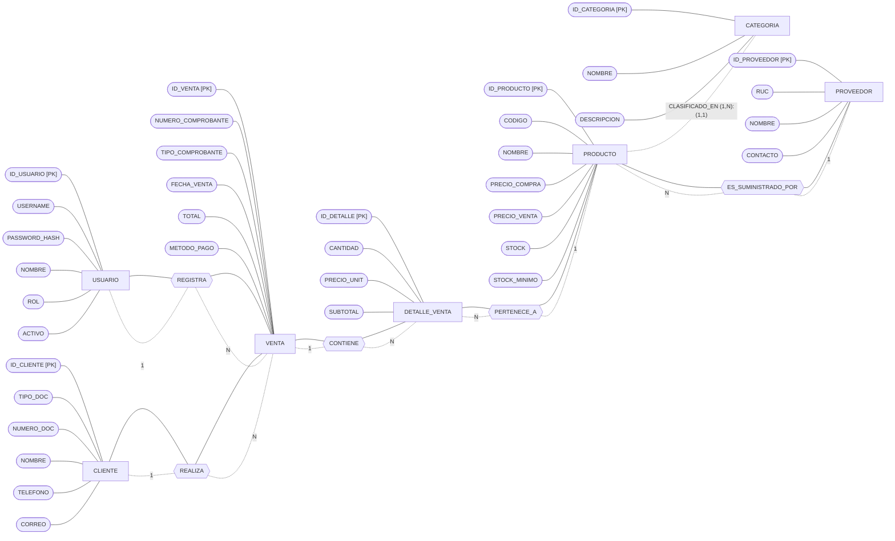
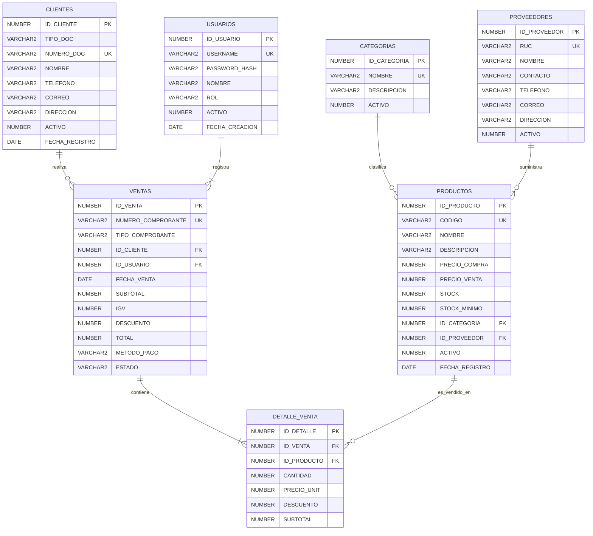
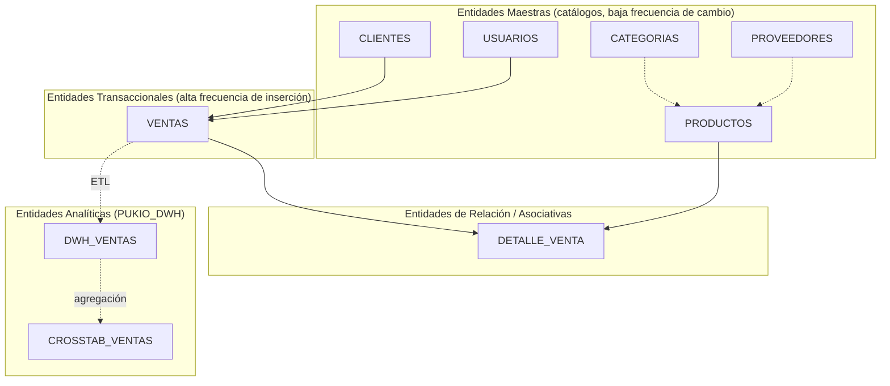
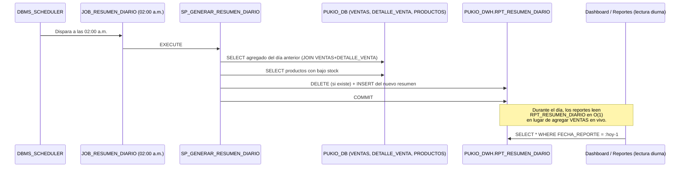

# Documentación de Base de Datos — PUKIO

> Análisis derivado de los scripts SQL (`sql/00` a `sql/04` y `sql/99`) y de las clases `DAO` del backend. Motor: **Oracle 21c XE**, desplegado en Docker (`gvenzl/oracle-xe:21-slim`). El sistema usa **dos esquemas**: `PUKIO_DB` (transaccional/OLTP) y `PUKIO_DWH` (analítico/OLAP).

---

## 1. Requisitos Funcionales de la Base de Datos

| ID | Requisito |
|----|-----------|
| RF-BD-01 | Como **administrador de base de datos**, quiero que existan dos esquemas separados (`PUKIO_DB` y `PUKIO_DWH`), para aislar la carga transaccional de la carga analítica y evitar que los reportes pesados afecten el rendimiento del punto de venta. |
| RF-BD-02 | Como **sistema transaccional**, quiero que cada tabla de catálogo (`PRODUCTOS`, `CLIENTES`, `PROVEEDORES`, `CATEGORIAS`, `USUARIOS`) tenga una clave primaria autogenerada (`GENERATED ALWAYS AS IDENTITY`), para garantizar identificadores únicos sin intervención de la aplicación. |
| RF-BD-03 | Como **sistema transaccional**, quiero que los campos de negocio críticos (`USERNAME`, `CODIGO` de producto, `RUC`, `NUMERO_DOC`, `NUMERO_COMPROBANTE`) tengan restricción `UNIQUE`, para impedir duplicados que rompan la lógica de negocio. |
| RF-BD-04 | Como **sistema transaccional**, quiero que la columna `ROL` de `USUARIOS` esté restringida por un `CHECK (ROL IN ('ADMIN','CAJERO'))`, para que la base de datos rechace roles inválidos incluso si la capa de aplicación tuviera un error. |
| RF-BD-05 | Como **sistema transaccional**, quiero que el stock de productos se descuente automáticamente mediante un trigger al insertar el detalle de una venta, para que la consistencia del inventario no dependa únicamente de la lógica en Java. |
| RF-BD-06 | Como **sistema transaccional**, quiero que la base de datos rechace una venta cuando el stock solicitado supere el disponible (vía `RAISE_APPLICATION_ERROR`), para evitar inventario negativo bajo cualquier circunstancia, incluida la concurrencia. |
| RF-BD-07 | Como **sistema transaccional**, quiero que el número de comprobante se genere de forma centralizada en un procedimiento almacenado (`SP_REGISTRAR_VENTA`) a partir de una secuencia (`SEQ_COMPROBANTE`), para asegurar correlatividad sin colisiones entre transacciones concurrentes. |
| RF-BD-08 | Como **analista de negocio**, quiero que exista una vista (`VW_VENTAS_DETALLADA`) que integre ventas, detalle, productos, clientes, usuarios y categorías con las dimensiones de tiempo ya calculadas (año, mes, día, trimestre), para simplificar la carga del Data Warehouse. |
| RF-BD-09 | Como **analista de negocio**, quiero que el Data Warehouse mantenga una tabla de hechos desnormalizada (`DWH_VENTAS`), para consultar el historial de ventas con buen rendimiento sin tener que hacer múltiples `JOIN` en cada reporte. |
| RF-BD-10 | Como **analista de negocio**, quiero que exista una tabla agregada tipo cubo OLAP (`CROSSTAB_VENTAS`) con totales por año, mes y categoría, para responder consultas analíticas frecuentes (ventas por periodo y rubro) sin recalcular agregaciones cada vez. |
| RF-BD-11 | Como **administrador de base de datos**, quiero índices sobre las columnas más consultadas (`CODIGO`, `NOMBRE` de producto, `NUMERO_DOC` de cliente, `FECHA_VENTA`, `ID_VENTA` en detalle), para que las búsquedas del POS y los reportes respondan con baja latencia. |
| RF-BD-12 | Como **administrador de base de datos**, quiero que el borrado de registros de catálogo (productos, clientes, proveedores) sea lógico (`ACTIVO=0`) y no físico, para preservar la integridad referencial del historial de ventas. |
| RF-BD-13 | Como **administrador de base de datos**, quiero scripts de aprovisionamiento y desmontaje idempotentes (`00_crear_usuario.sql`, `99_eliminar_todo.sql`), para poder recrear el entorno de base de datos de forma reproducible durante el desarrollo. |
| RF-BD-14 | Como **administrador de seguridad**, quiero que las contraseñas de usuario se almacenen únicamente como hash BCrypt en `PASSWORD_HASH`, para que la base de datos nunca contenga contraseñas en texto plano. |

---

## 2. Modelo Entidad-Relación (Notación de Chen)

El siguiente diagrama representa las entidades del esquema transaccional `PUKIO_DB` usando la notación clásica de Chen: **rectángulos** para entidades, **óvalos** para atributos (el atributo clave subrayado se indica con `[PK]`), y **rombos** para relaciones, con las cardinalidades indicadas en cada conexión.



**Lectura de cardinalidades:**

- Un `USUARIO` (cajero/admin) **REGISTRA** muchas `VENTA` (1:N) — una venta es registrada por exactamente un usuario.
- Un `CLIENTE` **REALIZA** muchas `VENTA` (1:N) — una venta pertenece opcionalmente a un cliente (puede ser el cliente genérico).
- Una `VENTA` **CONTIENE** muchos `DETALLE_VENTA` (1:N) — la entidad `DETALLE_VENTA` es una entidad **débil/asociativa**, no existe sin una `VENTA`.
- Cada `DETALLE_VENTA` **PERTENECE_A** exactamente un `PRODUCTO` (N:1).
- Un `PRODUCTO` **ES_SUMINISTRADO_POR** opcionalmente un `PROVEEDOR` (N:1, FK nullable).
- Un `PRODUCTO` está **CLASIFICADO_EN** exactamente una `CATEGORIA` (N:1, FK nullable).

---

## 3. Modelo Entidad-Relación Extendido (Notación Pata de Gallo / Crow's Foot)



**Notas sobre las cardinalidades pata de gallo:**

- `CATEGORIAS ||--o{ PRODUCTOS`: una categoría puede tener cero o muchos productos; un producto pertenece opcionalmente (`ID_CATEGORIA` es nullable) a una sola categoría.
- `PROVEEDORES ||--o{ PRODUCTOS`: análogo al anterior; `ID_PROVEEDOR` también es nullable en `PRODUCTOS`.
- `USUARIOS ||--|{ VENTAS`: relación obligatoria — `ID_USUARIO` en `VENTAS` es `NOT NULL` (toda venta requiere un cajero/usuario que la registre).
- `CLIENTES ||--o{ VENTAS`: relación opcional — `ID_CLIENTE` es nullable a nivel de esquema (aunque en la práctica siempre se asigna el cliente genérico desde la aplicación).
- `VENTAS ||--|{ DETALLE_VENTA`: relación obligatoria e identificadora — un detalle no puede existir sin su venta padre (`ID_VENTA NOT NULL`).
- `PRODUCTOS ||--o{ DETALLE_VENTA`: un producto puede aparecer en cero o muchas líneas de detalle a lo largo del tiempo.

---

## 4. Análisis de Forma Normal

### 4.1 Evaluación por tabla (esquema físico `PUKIO_DB`)

| Tabla | 1FN | 2FN | 3FN | Observación |
|---|---|---|---|---|
| `USUARIOS` | ✅ | ✅ | ✅ | Clave simple (`ID_USUARIO`), todos los atributos dependen solo de la PK. Sin atributos derivados. |
| `CATEGORIAS` | ✅ | ✅ | ✅ | Igual razonamiento; `NOMBRE` es además `UNIQUE`. |
| `PROVEEDORES` | ✅ | ✅ | ✅ | Clave simple, sin dependencias transitivas. |
| `PRODUCTOS` | ✅ | ✅ | ✅ | Almacena únicamente las **claves foráneas** `ID_CATEGORIA` e `ID_PROVEEDOR`, no los nombres de la categoría/proveedor. No hay dependencia transitiva en la tabla física. |
| `CLIENTES` | ✅ | ✅ | ✅ | Clave simple, atributos atómicos. |
| `VENTAS` | ✅ | ✅ | ✅ | `SUBTOTAL`, `IGV` y `TOTAL` son **derivados** (calculables a partir de `DETALLE_VENTA`), pero se materializan deliberadamente como una decisión de diseño (snapshot histórico e inmutable del importe cobrado), no como una falla de normalización: si cambiara el precio de un producto después de la venta, el comprobante histórico no debe cambiar. |
| `DETALLE_VENTA` | ✅ | ✅ | ✅ | `SUBTOTAL` por línea es igualmente un snapshot derivado y justificado (histórico de precio al momento de la venta). La clave es simple (`ID_DETALLE`), por lo que no hay dependencias parciales posibles. |

**Conclusión:** el esquema transaccional `PUKIO_DB`, tal como está definido en `01_crear_tablas.sql`, **ya se encuentra en Tercera Forma Normal (3FN)**. No existen grupos repetitivos (1FN), no hay dependencias parciales sobre claves compuestas porque todas las claves primarias son simples (2FN), y no existen dependencias transitivas no justificadas entre atributos no clave (3FN). Los únicos valores "redundantes" (`SUBTOTAL`, `IGV`, `TOTAL` en `VENTAS`/`DETALLE_VENTA`) son **snapshots históricos intencionales**, un patrón válido y común en sistemas transaccionales/contables, no una violación de 3FN.

### 4.2 Advertencia: desnormalización a nivel de DTO Java (no de base de datos)

Aunque la base de datos está en 3FN, se detectó una **redundancia a nivel del modelo Java `Producto`**: existen dos propiedades equivalentes, `nombreCategoria` y `categoriaNombre`, ambas pobladas desde la misma columna calculada `NOMBRE_CATEGORIA` (alias de `JOIN` en `ProductoDAO.SELECT_BASE`). Esto **no afecta la normalización del esquema SQL** (la tabla `PRODUCTOS` no almacena ese nombre), pero sí es deuda técnica a nivel de capa de aplicación. Recomendación: eliminar uno de los dos getters/setters duplicados en `Producto.java` para evitar inconsistencias de mantenimiento futuras.

### 4.3 Esquema `PUKIO_DWH`: desnormalización intencional (no aplica 3FN)

Las tablas `DWH_VENTAS` y `CROSSTAB_VENTAS` del esquema analítico **no están en 3FN por diseño**, y eso es correcto: un Data Warehouse orientado a lectura analítica favorece la desnormalización (modelo dimensional tipo estrella simplificado) para evitar `JOIN`s costosos en cada consulta de reporte. `DWH_VENTAS` repite intencionalmente `NOMBRE_CLIENTE`, `NOMBRE_CAJERO`, `NOMBRE_PRODUCTO` y `CATEGORIA` como texto plano en lugar de claves foráneas. **No se recomienda normalizar el DWH**; normalizarlo sería contraproducente para su propósito.

### 4.4 Recomendación general

Dado que `PUKIO_DB` ya cumple 3FN, la recomendación no es "llevarlo a 3FN" sino **mantener la disciplina de diseño actual** al añadir nuevas tablas:

1. No agregar columnas de texto derivadas (ej. `NOMBRE_CATEGORIA`) directamente en `PRODUCTOS`; mantenerlas solo en consultas (`JOIN`) o en el DWH.
2. Si se requiere mayor performance de lectura en el módulo POS, preferir una **vista materializada** o **caché en aplicación**, no la desnormalización de las tablas OLTP.
3. Unificar `nombreCategoria`/`categoriaNombre` en el DTO `Producto.java` para que la duplicación de la capa Java no se interprete erróneamente como un problema del modelo de datos.

---

## 5. Clasificación de Entidades



| Tipo | Entidades | Justificación |
|---|---|---|
| **Maestras** | `USUARIOS`, `CATEGORIAS`, `PROVEEDORES`, `PRODUCTOS`, `CLIENTES` | Representan los objetos de negocio relativamente estables: personas, catálogos y configuración. Cambian con baja frecuencia (altas/ediciones puntuales) y son referenciadas por las entidades transaccionales. `PRODUCTOS`, aunque tiene atributos mutables (`STOCK`), se clasifica como maestra porque su identidad y atributos descriptivos son estables; el stock es un atributo de estado, no la razón de ser de la entidad. |
| **Transaccionales** | `VENTAS` | Registra eventos de negocio con alta frecuencia de inserción (cada venta del POS genera un registro), marca temporal propia (`FECHA_VENTA`) y nunca se actualiza tras su creación (salvo cambio de `ESTADO`). |
| **Asociativas / de Relación** | `DETALLE_VENTA` | Resuelve la relación N:M conceptual entre `VENTAS` y `PRODUCTOS` (una venta tiene varios productos, un producto aparece en varias ventas), agregando atributos propios de la intersección (`CANTIDAD`, `PRECIO_UNIT`, `SUBTOTAL`). Es además una **entidad débil**, dependiente de `VENTAS` para existir. |
| **Analíticas (DWH)** | `DWH_VENTAS`, `CROSSTAB_VENTAS` | No forman parte del modelo transaccional; son el resultado de un proceso ETL/ELT sobre las entidades anteriores, optimizadas para consulta agregada y no para escritura operativa. |

---

## 6. Propuesta de Tabla de Reportes — Generación Nocturna (Job 2:00 a.m.)

### 6.1 Diseño de la tabla de soporte para reportes precalculados

Se propone una tabla `PUKIO_DWH.RPT_RESUMEN_DIARIO` que consolide, **cada noche**, los indicadores clave del día anterior, evitando que el dashboard y los reportes ejecutivos tengan que agregar la tabla `VENTAS` en tiempo real durante el horario de atención.

```sql
CREATE TABLE PUKIO_DWH.RPT_RESUMEN_DIARIO (
    ID_RESUMEN          NUMBER GENERATED ALWAYS AS IDENTITY PRIMARY KEY,
    FECHA_REPORTE       DATE            NOT NULL,
    TOTAL_VENTAS        NUMBER(10)      DEFAULT 0,
    TOTAL_UNIDADES      NUMBER(12)      DEFAULT 0,
    TOTAL_INGRESOS      NUMBER(14,2)    DEFAULT 0,
    TOTAL_IGV           NUMBER(14,2)    DEFAULT 0,
    TICKET_PROMEDIO     NUMBER(12,2)    DEFAULT 0,
    PRODUCTO_TOP_ID     NUMBER,
    PRODUCTO_TOP_NOMBRE VARCHAR2(150),
    CATEGORIA_TOP       VARCHAR2(80),
    PRODUCTOS_BAJO_STOCK NUMBER(10)     DEFAULT 0,
    CLIENTE_NUEVO_COUNT NUMBER(10)      DEFAULT 0,
    GENERADO_EN         TIMESTAMP       DEFAULT SYSTIMESTAMP,
    CONSTRAINT UQ_RPT_FECHA UNIQUE (FECHA_REPORTE)
);

COMMENT ON TABLE PUKIO_DWH.RPT_RESUMEN_DIARIO IS
    'Tabla de reportes precalculados, poblada por el job nocturno JOB_RESUMEN_DIARIO a las 02:00 a.m.';
```

### 6.2 Procedimiento de carga y `DBMS_SCHEDULER`

```sql
-- Procedimiento que calcula y carga el resumen del día anterior
CREATE OR REPLACE PROCEDURE PUKIO_DWH.SP_GENERAR_RESUMEN_DIARIO AS
    v_fecha DATE := TRUNC(SYSDATE) - 1; -- Día anterior (el job corre a las 02:00 a.m.)
BEGIN
    DELETE FROM PUKIO_DWH.RPT_RESUMEN_DIARIO WHERE FECHA_REPORTE = v_fecha;

    INSERT INTO PUKIO_DWH.RPT_RESUMEN_DIARIO (
        FECHA_REPORTE, TOTAL_VENTAS, TOTAL_UNIDADES, TOTAL_INGRESOS,
        TOTAL_IGV, TICKET_PROMEDIO, PRODUCTOS_BAJO_STOCK
    )
    SELECT
        v_fecha,
        COUNT(DISTINCT V.ID_VENTA),
        SUM(DV.CANTIDAD),
        SUM(DV.SUBTOTAL),
        MAX(V.IGV),
        ROUND(SUM(V.TOTAL) / NULLIF(COUNT(DISTINCT V.ID_VENTA), 0), 2),
        (SELECT COUNT(*) FROM PUKIO_DB.PRODUCTOS WHERE STOCK <= STOCK_MINIMO AND ACTIVO = 1)
    FROM PUKIO_DB.VENTAS V
    JOIN PUKIO_DB.DETALLE_VENTA DV ON DV.ID_VENTA = V.ID_VENTA
    WHERE TRUNC(V.FECHA_VENTA) = v_fecha;

    COMMIT;
EXCEPTION
    WHEN OTHERS THEN
        ROLLBACK;
        RAISE_APPLICATION_ERROR(-20010, 'Error generando resumen diario: ' || SQLERRM);
END;
/

-- Programación del job nocturno a las 2:00 a.m. (todos los días)
BEGIN
    DBMS_SCHEDULER.CREATE_JOB (
        job_name        => 'PUKIO_DWH.JOB_RESUMEN_DIARIO',
        job_type        => 'STORED_PROCEDURE',
        job_action      => 'PUKIO_DWH.SP_GENERAR_RESUMEN_DIARIO',
        start_date      => TRUNC(SYSDATE) + 2/24,   -- hoy a las 02:00 a.m.
        repeat_interval => 'FREQ=DAILY; BYHOUR=2; BYMINUTE=0; BYSECOND=0',
        enabled         => TRUE,
        comments        => 'Genera el resumen diario de ventas para reportes ejecutivos.'
    );
END;
/
```

### 6.3 Diagrama del flujo del job nocturno



> Se eligió **02:00 a.m.** porque es la franja de menor actividad transaccional para una bodega/minimarket típica (cerrada de noche), minimizando el riesgo de bloqueos sobre `VENTAS`/`DETALLE_VENTA` mientras el job lee datos del día recién cerrado.

---

## 7. Consultas JOIN para la Base de Datos

### 7.1 Detalle completo de una venta (cabecera + líneas + producto + categoría)

```sql
SELECT
    V.NUMERO_COMPROBANTE,
    V.FECHA_VENTA,
    C.NOMBRE        AS CLIENTE,
    U.NOMBRE        AS CAJERO,
    P.NOMBRE        AS PRODUCTO,
    CAT.NOMBRE      AS CATEGORIA,
    DV.CANTIDAD,
    DV.PRECIO_UNIT,
    DV.SUBTOTAL
FROM VENTAS V
INNER JOIN USUARIOS U        ON U.ID_USUARIO   = V.ID_USUARIO
LEFT JOIN  CLIENTES C        ON C.ID_CLIENTE   = V.ID_CLIENTE
INNER JOIN DETALLE_VENTA DV  ON DV.ID_VENTA    = V.ID_VENTA
INNER JOIN PRODUCTOS P       ON P.ID_PRODUCTO  = DV.ID_PRODUCTO
LEFT JOIN  CATEGORIAS CAT    ON CAT.ID_CATEGORIA = P.ID_CATEGORIA
WHERE V.NUMERO_COMPROBANTE = 'BOL-000001'
ORDER BY DV.ID_DETALLE;
```
*(Equivalente a la construcción de `VW_VENTAS_DETALLADA` en `03_crear_dwh.sql`, pero filtrada a un comprobante puntual. `LEFT JOIN` en `CLIENTES` porque la venta puede no tener cliente identificado; `INNER JOIN` en `USUARIOS` porque toda venta requiere un cajero.)*

### 7.2 Catálogo de productos con categoría y proveedor (la consulta base de `ProductoDAO`)

```sql
SELECT
    P.ID_PRODUCTO,
    P.CODIGO,
    P.NOMBRE,
    P.STOCK,
    P.STOCK_MINIMO,
    C.NOMBRE  AS NOMBRE_CATEGORIA,
    PR.NOMBRE AS NOMBRE_PROVEEDOR
FROM PRODUCTOS P
LEFT JOIN CATEGORIAS C  ON C.ID_CATEGORIA = P.ID_CATEGORIA
LEFT JOIN PROVEEDORES PR ON PR.ID_PROVEEDOR = P.ID_PROVEEDOR
WHERE P.ACTIVO = 1
ORDER BY P.NOMBRE;
```

### 7.3 Productos con bajo stock, agrupados por proveedor (para generar órdenes de compra)

```sql
SELECT
    PR.NOMBRE        AS PROVEEDOR,
    PR.TELEFONO,
    COUNT(*)         AS PRODUCTOS_EN_ALERTA,
    SUM(P.STOCK_MINIMO - P.STOCK) AS UNIDADES_FALTANTES_APROX
FROM PRODUCTOS P
INNER JOIN PROVEEDORES PR ON PR.ID_PROVEEDOR = P.ID_PROVEEDOR
WHERE P.ACTIVO = 1
  AND P.STOCK <= P.STOCK_MINIMO
GROUP BY PR.NOMBRE, PR.TELEFONO
ORDER BY PRODUCTOS_EN_ALERTA DESC;
```

### 7.4 Ranking de productos más vendidos por categoría (equivalente ampliado a `VentaDAO.productosMasVendidos`)

```sql
SELECT
    CAT.NOMBRE         AS CATEGORIA,
    P.NOMBRE           AS PRODUCTO,
    SUM(DV.CANTIDAD)   AS UNIDADES_VENDIDAS,
    SUM(DV.SUBTOTAL)   AS INGRESOS_GENERADOS
FROM DETALLE_VENTA DV
INNER JOIN PRODUCTOS P    ON P.ID_PRODUCTO   = DV.ID_PRODUCTO
LEFT JOIN  CATEGORIAS CAT ON CAT.ID_CATEGORIA = P.ID_CATEGORIA
INNER JOIN VENTAS V       ON V.ID_VENTA      = DV.ID_VENTA
WHERE V.ESTADO = 'COMPLETADA'
GROUP BY CAT.NOMBRE, P.NOMBRE
ORDER BY UNIDADES_VENDIDAS DESC
FETCH FIRST 10 ROWS ONLY;
```

### 7.5 Historial de compras por cliente (autoservicio / fidelización)

```sql
SELECT
    CL.NOMBRE              AS CLIENTE,
    V.NUMERO_COMPROBANTE,
    V.FECHA_VENTA,
    V.TOTAL,
    COUNT(DV.ID_DETALLE)   AS CANTIDAD_ITEMS
FROM CLIENTES CL
INNER JOIN VENTAS V        ON V.ID_CLIENTE = CL.ID_CLIENTE
INNER JOIN DETALLE_VENTA DV ON DV.ID_VENTA = V.ID_VENTA
WHERE CL.NUMERO_DOC = :numero_documento
GROUP BY CL.NOMBRE, V.NUMERO_COMPROBANTE, V.FECHA_VENTA, V.TOTAL
ORDER BY V.FECHA_VENTA DESC;
```

### 7.6 Auditoría cruzada: ventas registradas por cada cajero, con su rol (RIGHT JOIN ilustrativo)

```sql
-- RIGHT JOIN para detectar usuarios (p.ej. cajeros recién creados) que aún no han
-- registrado ninguna venta — útil para auditoría de actividad del personal.
SELECT
    U.NOMBRE        AS CAJERO,
    U.ROL,
    COUNT(V.ID_VENTA) AS VENTAS_REGISTRADAS,
    NVL(SUM(V.TOTAL), 0) AS TOTAL_VENDIDO
FROM VENTAS V
RIGHT JOIN USUARIOS U ON U.ID_USUARIO = V.ID_USUARIO
WHERE U.ACTIVO = 1
GROUP BY U.NOMBRE, U.ROL
ORDER BY TOTAL_VENDIDO DESC;
```

---

## 8. Simulación de Errores `ALTER TABLE`

A continuación, una simulación de los errores más comunes que un desarrollador del equipo PUKIO encontraría al intentar modificar el esquema, junto con la causa y la corrección.

### 8.1 Error por violar `NOT NULL` en una tabla con datos existentes

```sql
ALTER TABLE PRODUCTOS ADD (
    UNIDAD_MEDIDA VARCHAR2(10) NOT NULL
);
```
```
ERROR en línea 1:
ORA-01758: la tabla debe estar vacía para añadir una columna obligatoria (NOT NULL)
```
**Causa:** Oracle no permite agregar una columna `NOT NULL` sin `DEFAULT` a una tabla que ya contiene filas (los `8` productos insertados en `02_insertar_datos.sql` no tendrían valor para la nueva columna).

**Corrección:**
```sql
ALTER TABLE PRODUCTOS ADD (
    UNIDAD_MEDIDA VARCHAR2(10) DEFAULT 'UND' NOT NULL
);
```

---

### 8.2 Error al intentar eliminar una columna referenciada en una vista

```sql
ALTER TABLE PRODUCTOS DROP COLUMN PRECIO_VENTA;
```
```
ERROR en línea 1:
ORA-12996: no se puede eliminar la única columna de la clave de la tabla
```
*(Variante real más probable en este esquema, dado que `VW_VENTAS_DETALLADA` referencia indirectamente datos de `PRODUCTOS` vía `DETALLE_VENTA.PRECIO_UNIT`, que no depende directamente de esta columna; el error más representativo del proyecto ocurriría así:)*

```sql
ALTER TABLE PRODUCTOS DROP COLUMN ID_PRODUCTO;
```
```
ERROR en línea 1:
ORA-12992: no se puede eliminar columna referenciada en restricción multicolumna
```
**Causa:** `ID_PRODUCTO` es la clave primaria de `PRODUCTOS` y está referenciada como clave foránea desde `DETALLE_VENTA.ID_PRODUCTO`. Oracle protege la integridad referencial e impide eliminar la columna mientras existan dependientes.

**Corrección:** primero eliminar (o redefinir) las restricciones dependientes, o evaluar si realmente se desea eliminar la PK de una tabla con historial transaccional (en la práctica, **no se recomienda** eliminar `ID_PRODUCTO`; este es un ejemplo didáctico del tipo de error).

---

### 8.3 Error por restricción `CHECK` violada al insertar/actualizar tras un `ALTER`

```sql
ALTER TABLE USUARIOS ADD CONSTRAINT CK_USUARIOS_ROL_EXT
    CHECK (ROL IN ('ADMIN', 'CAJERO', 'SUPERVISOR'));

-- Luego, si ya existiera un registro con rol distinto a estos tres valores:
ALTER TABLE USUARIOS MODIFY (ROL VARCHAR2(20) DEFAULT 'CAJERO');
UPDATE USUARIOS SET ROL = 'VENDEDOR' WHERE ID_USUARIO = 1;
```
```
ERROR en línea 1:
ORA-02290: restricción de control (PUKIO_DB.SYS_C0012345) violada
```
**Causa:** el `CHECK` original (`CK ROL IN ('ADMIN','CAJERO')` definido en `01_crear_tablas.sql`) sigue activo y no contempla el valor `'VENDEDOR'`; el `ALTER TABLE ADD CONSTRAINT` con un nombre distinto **no reemplaza** la restricción original, ambas coexisten.

**Corrección:** eliminar explícitamente la restricción original antes de añadir la nueva versión ampliada:
```sql
ALTER TABLE USUARIOS DROP CONSTRAINT SYS_C0012345;  -- o el nombre real generado por Oracle
ALTER TABLE USUARIOS ADD CONSTRAINT CK_USUARIOS_ROL
    CHECK (ROL IN ('ADMIN', 'CAJERO', 'SUPERVISOR'));
```
> Recomendación de buena práctica: nombrar explícitamente todos los `CHECK` (`CONSTRAINT CK_USUARIOS_ROL CHECK (...)`) desde la creación original de la tabla, para evitar depender de nombres autogenerados (`SYS_C00...`) difíciles de referenciar en scripts de mantenimiento futuros.

---

### 8.4 Error por tipo de dato incompatible al modificar una columna con datos

```sql
ALTER TABLE CLIENTES MODIFY (NUMERO_DOC NUMBER);
```
```
ERROR en línea 1:
ORA-01439: la columna a modificar debe estar vacía para cambiar el tipo de datos
```
**Causa:** `NUMERO_DOC` es `VARCHAR2(20)` y ya contiene datos (`'00000000'`, `'12345678'`, etc.); Oracle no permite convertir directamente de `VARCHAR2` a `NUMBER` mediante `MODIFY` cuando la columna tiene filas, incluso si los valores son numéricamente válidos.

**Corrección recomendada (patrón de migración segura en 3 pasos):**
```sql
ALTER TABLE CLIENTES ADD (NUMERO_DOC_TMP NUMBER);
UPDATE CLIENTES SET NUMERO_DOC_TMP = TO_NUMBER(NUMERO_DOC);
ALTER TABLE CLIENTES DROP COLUMN NUMERO_DOC;
ALTER TABLE CLIENTES RENAME COLUMN NUMERO_DOC_TMP TO NUMERO_DOC;
```
*(Nota: en la práctica, mantener `NUMERO_DOC` como `VARCHAR2` es la decisión correcta, ya que el RUC puede requerir ceros a la izquierda y formato fijo; este ejemplo es exclusivamente ilustrativo del error y su patrón de remediación.)*

---

### 8.5 Error por exceder la longitud máxima al reducir el tamaño de una columna

```sql
ALTER TABLE PROVEEDORES MODIFY (NOMBRE VARCHAR2(20));
```
```
ERROR en línea 1:
ORA-01441: no se puede reducir la longitud de la columna porque algunos valores son demasiado anchos
```
**Causa:** el proveedor sembrado `'Distribuidora El Sol S.A.C.'` (28 caracteres) y `'Alicorp Peru S.A.A.'` no entran en `VARCHAR2(20)`.

**Corrección:** validar la longitud máxima real de los datos existentes antes de reducir la columna:
```sql
SELECT MAX(LENGTH(NOMBRE)) FROM PROVEEDORES;  -- Verificar longitud real primero
ALTER TABLE PROVEEDORES MODIFY (NOMBRE VARCHAR2(150)); -- Mantener o ampliar, no reducir sin migrar datos
```

---

### 8.6 Error por nombre de restricción duplicado entre esquemas (UNIQUE)

```sql
ALTER TABLE PUKIO_DWH.CROSSTAB_VENTAS
    ADD CONSTRAINT PK_CT UNIQUE (ANIO, MES, CATEGORIA);
```
```
ERROR en línea 1:
ORA-02264: el nombre ya está siendo utilizado por una restricción existente
```
**Causa:** la restricción `PK_CT` **ya existe** — fue definida inline durante el `CREATE TABLE` en `03_crear_dwh.sql` (`CONSTRAINT PK_CT UNIQUE (ANIO, MES, CATEGORIA)`). Intentar agregarla nuevamente con `ALTER TABLE` provoca colisión de nombre dentro del mismo esquema.

**Corrección:** verificar primero la existencia de la restricción antes de crearla, o usar un bloque condicional:
```sql
BEGIN
    EXECUTE IMMEDIATE
        'ALTER TABLE PUKIO_DWH.CROSSTAB_VENTAS ADD CONSTRAINT PK_CT UNIQUE (ANIO, MES, CATEGORIA)';
EXCEPTION
    WHEN OTHERS THEN
        IF SQLCODE != -2264 THEN RAISE; END IF; -- Ignorar solo si ya existe
END;
/
```

---

## 9. Resumen de Objetos de Base de Datos

| Tipo de objeto | Cantidad | Ejemplos |
|---|---|---|
| Esquemas | 2 | `PUKIO_DB`, `PUKIO_DWH` |
| Tablas transaccionales | 7 | `USUARIOS`, `CATEGORIAS`, `PROVEEDORES`, `PRODUCTOS`, `CLIENTES`, `VENTAS`, `DETALLE_VENTA` |
| Tablas analíticas | 2 | `DWH_VENTAS`, `CROSSTAB_VENTAS` |
| Vistas | 1 | `VW_VENTAS_DETALLADA` |
| Secuencias | 1 | `SEQ_COMPROBANTE` |
| Procedimientos almacenados | 1 | `SP_REGISTRAR_VENTA` |
| Triggers | 1 | `TRG_DETALLE_VENTA_STOCK` |
| Índices explícitos | 5 | `IDX_PROD_CODIGO`, `IDX_PROD_NOMBRE`, `IDX_CLI_NUMDOC`, `IDX_VENTA_FECHA`, `IDX_DET_VENTA` |
| Códigos de error de negocio reservados | 2 | `-20001` (stock insuficiente), `-20002` (error registrando cabecera de venta) |