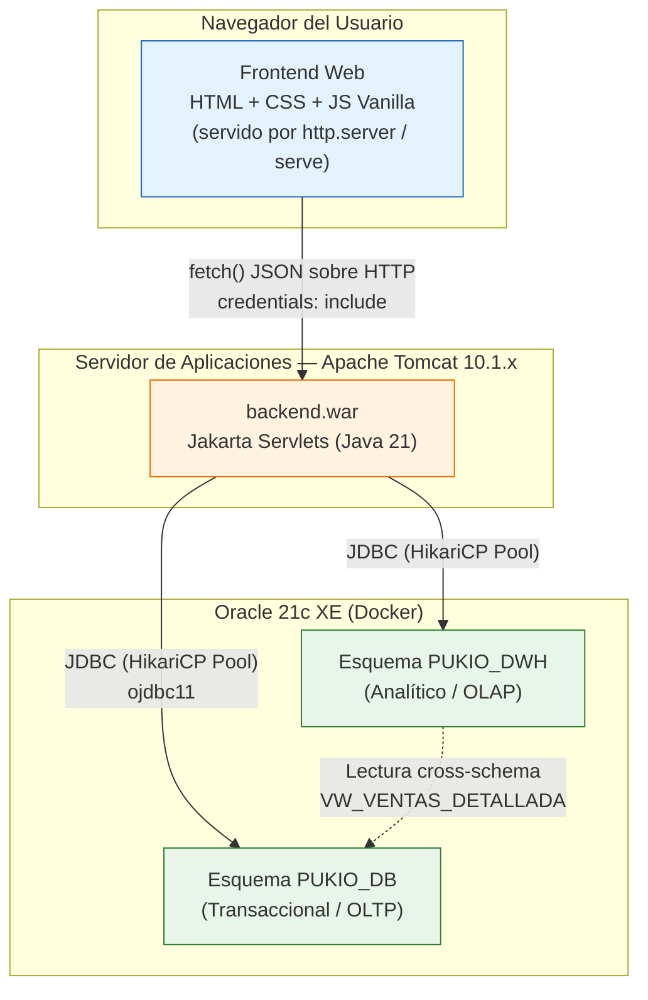
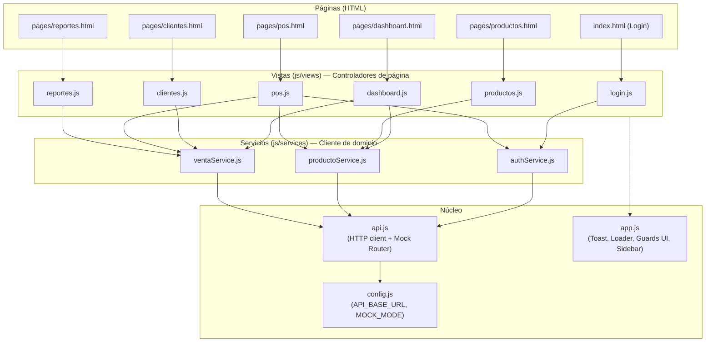
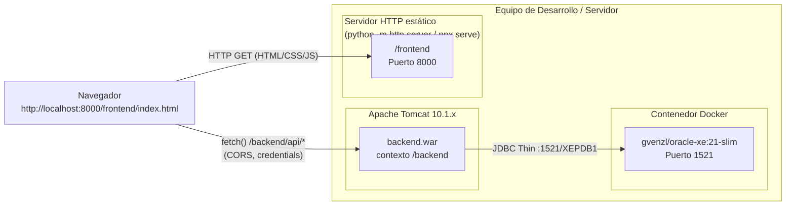
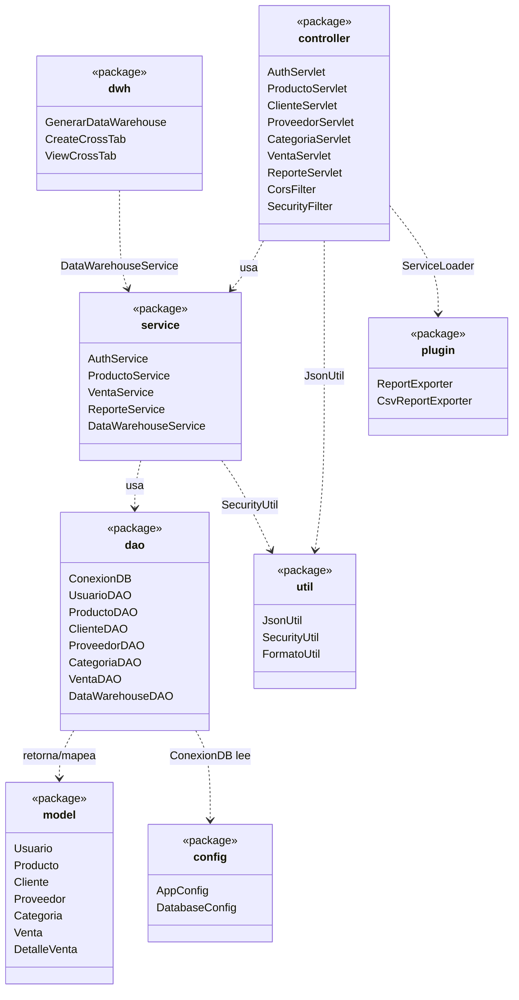
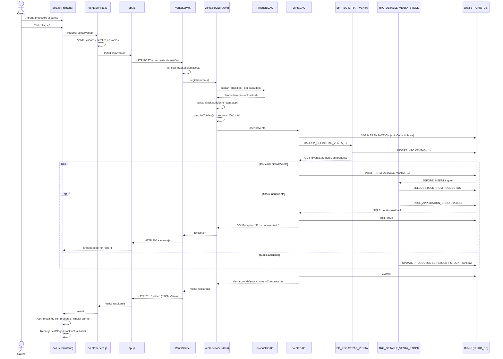
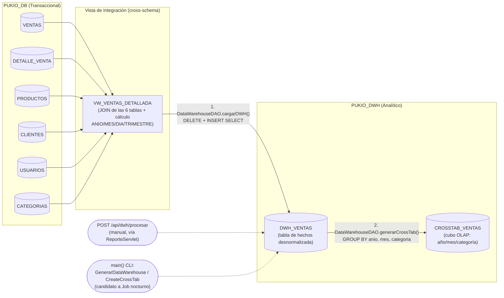
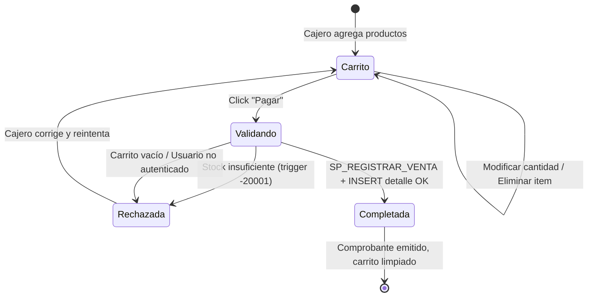

# Documento de Diseño y Arquitectura — PUKIO

> Arquitectura derivada del análisis del código fuente. PUKIO es un sistema POS web con **arquitectura en capas** en el backend (Servlets → Service → DAO → Modelo), un **frontend desacoplado** (JS vanilla sin frameworks ni build tools) y una **base de datos Oracle 21c XE multi-esquema** que separa la capa transaccional (OLTP) de la capa analítica (Data Warehouse / OLAP).

---

## 1. Visión General del Sistema

---

## 2. Arquitectura en Capas del Backend

El backend sigue un patrón **N-capas** clásico: `Controller (Servlet)` → `Service` → `DAO` → `Model`, con utilidades transversales (`util`, `config`) y un mecanismo de extensión por plugins (`plugin` + `ServiceLoader`).

```mermaid
flowchart TB
    subgraph L1["Capa de Presentación (controller)"]
        AuthServlet
        ProductoServlet
        ClienteServlet
        ProveedorServlet
        CategoriaServlet
        VentaServlet
        ReporteServlet
        CorsFilter["CorsFilter (Filter)"]
        SecurityFilter["SecurityFilter (Filter)"]
    end

    subgraph L2["Capa de Negocio (service)"]
        AuthService
        ProductoService
        VentaService
        ReporteService
        DataWarehouseService
    end

    subgraph L3["Capa de Acceso a Datos (dao)"]
        UsuarioDAO
        ProductoDAO
        ClienteDAO
        ProveedorDAO
        CategoriaDAO
        VentaDAO
        DataWarehouseDAO
        ConexionDB["ConexionDB<br/>(HikariCP wrapper)"]
    end

    subgraph L4["Capa de Modelo (model)"]
        Usuario
        Producto
        Cliente
        Proveedor
        Categoria
        Venta
        DetalleVenta
    end

    subgraph L5["Transversal"]
        JsonUtil
        SecurityUtil["SecurityUtil (BCrypt)"]
        FormatoUtil
        AppConfig
        DatabaseConfig
        ReportExporter["ReportExporter (SPI)"]
        CsvReportExporter
    end

    CorsFilter --> AuthServlet
    SecurityFilter --> AuthServlet
    AuthServlet --> AuthService --> UsuarioDAO
    ProductoServlet --> ProductoService --> ProductoDAO
    ClienteServlet --> ClienteDAO
    ProveedorServlet --> ProveedorDAO
    CategoriaServlet --> CategoriaDAO
    VentaServlet --> VentaService --> VentaDAO
    VentaService --> ProductoDAO
    ReporteServlet --> ReporteService --> VentaDAO
    ReporteServlet --> DataWarehouseService --> DataWarehouseDAO
    ReporteServlet -. "ServiceLoader.load()" .-> ReportExporter
    CsvReportExporter -. "implements" .-> ReportExporter

    UsuarioDAO --> ConexionDB
    ProductoDAO --> ConexionDB
    ClienteDAO --> ConexionDB
    ProveedorDAO --> ConexionDB
    CategoriaDAO --> ConexionDB
    VentaDAO --> ConexionDB
    DataWarehouseDAO --> ConexionDB

    UsuarioDAO -.-> Usuario
    ProductoDAO -.-> Producto
    ClienteDAO -.-> Cliente
    ProveedorDAO -.-> Proveedor
    CategoriaDAO -.-> Categoria
    VentaDAO -.-> Venta
    Venta --> DetalleVenta

    AuthService --> SecurityUtil
    L1 --> JsonUtil
    ConexionDB --> DatabaseConfig
    Venta --> AppConfig
```

**Decisiones de diseño observadas:**

- **Servlets por recurso**: cada `@WebServlet` mapea uno o varios `urlPatterns` relacionados a un mismo recurso REST (ej. `ProductoServlet` atiende `/api/productos`, `/api/productos/buscar` y `/api/productos/bajo-stock`).
- **Filtros transversales (`Filter`)**: `CorsFilter` (whitelist de origen) y `SecurityFilter` (validación de `HttpSession`) interceptan todo `/api/*` antes de llegar al Servlet.
- **DAO con JDBC puro**: no se usa un ORM; cada DAO abre conexión vía `ConexionDB.getConnection()` (pool HikariCP) con `try-with-resources` y maneja sus propias transacciones (`setAutoCommit(false)` + `commit()`/`rollback()`).
- **Lógica crítica delegada a la base de datos**: el registro de venta usa un **procedimiento almacenado** (`SP_REGISTRAR_VENTA`) para la cabecera, y un **trigger** (`TRG_DETALLE_VENTA_STOCK`) para validar y descontar stock línea por línea — esto garantiza atomicidad incluso ante accesos concurrentes a nivel de motor de base de datos.
- **Extensibilidad por SPI**: `ReportExporter` es una interfaz cargada dinámicamente vía `java.util.ServiceLoader`, registrada en `META-INF/services/com.pukio.plugin.ReportExporter`. Agregar un nuevo formato de exportación (PDF, XLSX) no requiere modificar `ReporteServlet`.
- **Utilitarios de procesos batch (`dwh`)**: `GenerarDataWarehouse`, `CreateCrossTab` y `ViewCrossTab` son clases con `main()` ejecutables de forma independiente (CLI), pensadas para tareas programadas (cron/Task Scheduler) fuera del ciclo de vida web.

---

## 3. Arquitectura del Frontend

**Características de diseño del frontend:**

- **Sin frameworks ni bundlers**: módulos ES (`import`/`export`) cargados directamente por el navegador (`<script type="module">`), sin Webpack/Vite.
- **Patrón de capas equivalente al backend**: `views` (controladores de UI) → `services` (lógica de dominio/validación cliente) → `api.js` (transporte HTTP).
- **Doble modo de operación en `api.js`**:
  - **Modo real** (`MOCK_MODE=false`, valor por defecto en `config.example.js`): usa `fetch()` contra `API_BASE_URL` con `credentials: 'include'` para enviar la cookie de sesión.
  - **Modo simulado** (`MOCK_MODE=true`): enrutador interno (`handleMockRequest`) que persiste un dataset de ejemplo en `localStorage`, permitiendo desarrollar/demostrar la UI sin backend Java ni Oracle activos.
- **Guardas de sesión en cliente** (`AuthService.checkGuard` / `checkLoginGuard`): complementan (no sustituyen) al `SecurityFilter` del backend.
- **Control de acceso por rol en la UI**: `app.js` oculta el ítem de menú "Reportes" si el usuario autenticado tiene rol `CAJERO`.

---

## 4. Diagrama de Despliegue

| Componente | Tecnología | Puerto por defecto |
|---|---|---|
| Base de datos | Oracle 21c XE (`gvenzl/oracle-xe:21-slim`, Docker) | 1521 |
| Backend | Java 21 + Jakarta Servlet API 6.0 sobre Apache Tomcat 10.1.x | 8080 |
| Frontend | Archivos estáticos (HTML/CSS/JS) servidos por `http.server` o `serve` | 8000 |
| Cliente DB (admin) | DBeaver Community u otro cliente Oracle | — |

---

## 5. Modelo de Paquetes Java (`com.pukio`)

---

## 6. Flujo Crítico: Registro de una Venta (Secuencia)

Este flujo ilustra cómo colaboran frontend, backend y base de datos (incluido el procedimiento almacenado y el trigger de stock) en la operación más sensible del sistema.

**Punto de diseño destacado:** existe una **doble validación de stock** — una optimista en `VentaService` (Java, antes del INSERT) y otra autoritativa en `TRG_DETALLE_VENTA_STOCK` (PL/SQL, durante el INSERT). La validación de base de datos es la que realmente garantiza la consistencia bajo concurrencia, ya que la validación de aplicación puede sufrir condiciones de carrera (TOCTOU) entre la lectura del stock y el INSERT real.

---

## 7. Flujo del Proceso ETL / Data Warehouse

- El proceso es **ELT manual** disparado por `POST /api/dwh/procesar` desde la UI de Reportes, o ejecutable por CLI (`GenerarDataWarehouse`, `CreateCrossTab`) para automatización por **Task Scheduler / cron**.
- `DWH_VENTAS` es una tabla de hechos desnormalizada (incluye nombres en texto en vez de solo IDs), típica de un Data Warehouse orientado a lectura analítica.
- `CROSSTAB_VENTAS` es el resultado de una agregación OLAP simple (`SUM`, `COUNT DISTINCT`) materializada como tabla, simulando un cubo de "ventas por categoría y mes".

---

## 8. Estados de una Venta

---

## 9. Resumen de Endpoints REST Expuestos

| Recurso | Método | Ruta | Servlet | Autenticación |
|---|---|---|---|---|
| Autenticación | POST | `/api/auth/login` | `AuthServlet` | Pública |
| Autenticación | POST | `/api/auth/logout` | `AuthServlet` | Requiere sesión |
| Autenticación | GET | `/api/auth/session` | `AuthServlet` | Pública (verifica) |
| Productos | GET | `/api/productos` | `ProductoServlet` | Requiere sesión |
| Productos | GET | `/api/productos/buscar` | `ProductoServlet` | Requiere sesión |
| Productos | GET | `/api/productos/bajo-stock` | `ProductoServlet` | Requiere sesión |
| Productos | POST/PUT | `/api/productos` | `ProductoServlet` | Requiere sesión |
| Productos | DELETE | `/api/productos?id=` | `ProductoServlet` | Requiere sesión |
| Categorías | GET | `/api/categorias` | `CategoriaServlet` | Requiere sesión |
| Proveedores | GET | `/api/proveedores` | `ProveedorServlet` | Requiere sesión |
| Clientes | GET | `/api/clientes`, `/api/clientes/buscar` | `ClienteServlet` | Requiere sesión |
| Clientes | POST/PUT/DELETE | `/api/clientes` | `ClienteServlet` | Requiere sesión |
| Ventas | GET | `/api/ventas/resumen-hoy` | `VentaServlet` | Requiere sesión |
| Ventas | POST | `/api/ventas` | `VentaServlet` | Requiere sesión |
| Reportes | GET | `/api/reportes/ventas` | `ReporteServlet` | Requiere sesión |
| Reportes | GET | `/api/reportes/productos-top` | `ReporteServlet` | Requiere sesión |
| Reportes | GET | `/api/reportes/exportar?formato=csv` | `ReporteServlet` | Requiere sesión |
| DWH/OLAP | GET | `/api/dwh/crosstab` | `ReporteServlet` | Requiere sesión |
| DWH/OLAP | POST | `/api/dwh/procesar` | `ReporteServlet` | Requiere sesión |

---

## 10. Stack Tecnológico

| Capa | Tecnología |
|---|---|
| Lenguaje backend | Java 21 |
| Framework web backend | Jakarta Servlet API 6.0 (sin Spring) |
| Servidor de aplicaciones | Apache Tomcat 10.1.x |
| Build tool backend | Apache Maven (empaquetado `.war`) |
| Driver de base de datos | Oracle JDBC Thin (`ojdbc11` 23.3.0.23.09) |
| Pool de conexiones | HikariCP 5.1.0 |
| Serialización JSON | Google Gson 2.10.1 |
| Hashing de contraseñas | jBCrypt 0.4 (factor de costo 12) |
| Base de datos | Oracle 21c XE (contenedor `gvenzl/oracle-xe:21-slim`) |
| Frontend | HTML5 + CSS3 + JavaScript ES Modules (sin frameworks) |
| Servidor de archivos estáticos (dev) | `python -m http.server` / `npx serve` |