# Design Document — Sistema POS Pukio
 
## Tabla de Contenidos
 
1. [Visión General](#visión-general)
2. [Stack Tecnológico](#stack-tecnológico)
3. [Entregable 1 — Arquitectura Unitaria con Servidor de Datos](#entregable-1--arquitectura-unitaria-con-servidor-de-datos)
4. [Entregable 2 — Arquitectura Cliente/Servidor](#entregable-2--arquitectura-clienteservidor)
5. [Entregable 3 — Arquitectura N-Capas](#entregable-3--arquitectura-n-capas)
6. [Entregable 4 — Cloud Computing](#entregable-4--cloud-computing)
7. [Modelo de Datos Común](#modelo-de-datos-común)
8. [Requisitos Transversales](#requisitos-transversales)
---
 
## Visión General
 
**Pukio** es un sistema de Punto de Venta (POS) para tiendas minoristas que evoluciona progresivamente a través de cuatro entregables arquitectónicos. El sistema gestiona productos, inventario, ventas, promociones, arqueo de caja y reportes analíticos, utilizando exclusivamente tecnologías gratuitas y open-source.
 
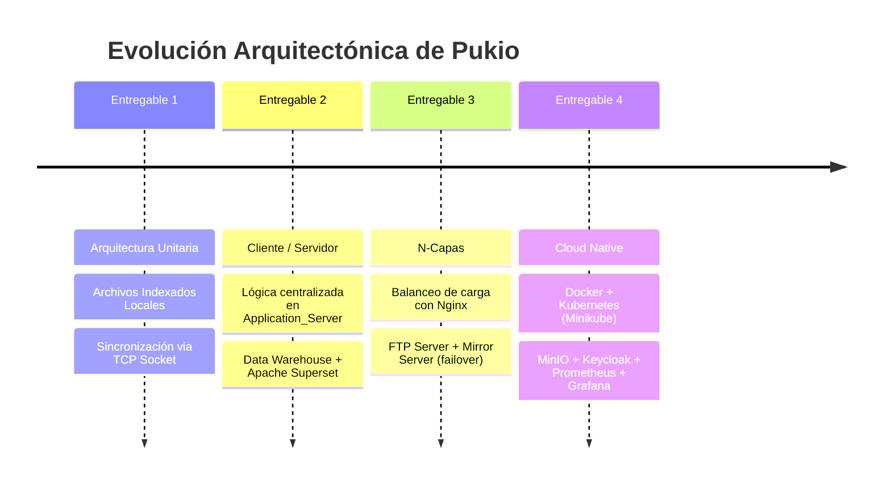
```mermaid
timeline
    title Evolución Arquitectónica de Pukio
    Entregable 1 : Arquitectura Unitaria
               : Archivos Indexados Locales
               : Sincronización via TCP Socket
    Entregable 2 : Cliente / Servidor
               : Lógica centralizada en Application_Server
               : Data Warehouse + Apache Superset
    Entregable 3 : N-Capas
               : Balanceo de carga con Nginx
               : FTP Server + Mirror Server (failover)
    Entregable 4 : Cloud Native
               : Docker + Kubernetes (Minikube)
               : MinIO + Keycloak + Prometheus + Grafana
```
 
---
 
## Stack Tecnológico
 
| Componente                        | Tecnología                               | Versión                           |
|-----------------------------------|------------------------------------------|-----------------------------------|
| Lenguaje / Runtime                | Oracle JDK                               | 21                                |
| Framework                         | Spring Boot                              | 3.3.5                             |
| Build Tool                        | Maven                                    | 3.9.9                             |
| Base de Datos Relacional          | PostgreSQL                               | 18.1                              |
| Contenedores                      | Docker                                   | 29.2.0                            |
| Orquestación                      | Minikube (Kubernetes)                    | v1.38.1                           |
| Load Balancer                     | Nginx                                    | 1.28.3                            |
| FTP Server                        | vsftpd / ProFTPD                         | 3.0.5 / 1.3.8b                    |
| Object Storage                    | MinIO                                    | RELEASE.2025-09-07T16-13-09Z      |
| Identity & Access Management      | Keycloak                                 | 26.5.6                            |
| Métricas                          | Prometheus                               | 3.4.0                             |
| Visualización / Dashboards        | Grafana OSS                              | 12.0.1                            |
| Log Management                    | ELK Stack (Elasticsearch/Logstash/Kibana)| 8.17.0                            |
| Log Management (alternativa)      | Grafana Loki                             | 3.4.3                             |
| Analytics / BI                    | Apache Superset                          | 6.1.0                             |
| Certificados SSL                  | Let's Encrypt / Certbot                  | 3.3.0                             |
| Firewall                          | iptables / firewalld                     | —                                 |
 
---
 
## Entregable 1 — Arquitectura Unitaria con Servidor de Datos
 
### Descripción General
 
El sistema opera como una arquitectura unitaria distribuida físicamente en dos nodos: el **terminal de tienda** (con `Maintenance_System` y `POS_Client`) y el **servidor central** (con `Update_Service` y `Data_Server` PostgreSQL). Toda la persistencia local usa **archivos indexados binarios** (sin bases de datos embebidas). La sincronización ocurre mediante sockets TCP/IP.
 
### Diagrama de Despliegue
 
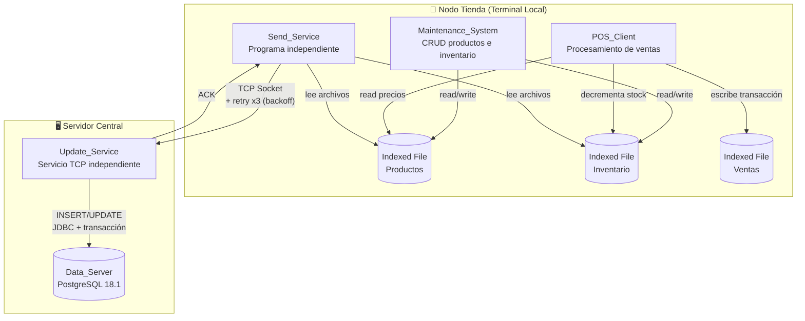
```mermaid
graph TB
    subgraph TIENDA["🏪 Nodo Tienda (Terminal Local)"]
        MS[Maintenance_System<br/>CRUD productos e inventario]
        PC[POS_Client<br/>Procesamiento de ventas]
        IF_PROD[(Indexed File<br/>Productos)]
        IF_INV[(Indexed File<br/>Inventario)]
        IF_SALES[(Indexed File<br/>Ventas)]
        SS[Send_Service<br/>Programa independiente]
 
        MS -->|read/write| IF_PROD
        MS -->|read/write| IF_INV
        PC -->|read precios| IF_PROD
        PC -->|decrementa stock| IF_INV
        PC -->|escribe transacción| IF_SALES
        SS -->|lee archivos| IF_PROD
        SS -->|lee archivos| IF_INV
    end
 
    subgraph SERVIDOR["🖥️ Servidor Central"]
        US[Update_Service<br/>Servicio TCP independiente]
        DS[(Data_Server<br/>PostgreSQL 18.1)]
 
        US -->|INSERT/UPDATE<br/>JDBC + transacción| DS
    end
 
    SS -->|"TCP Socket<br/>+ retry x3 (backoff)"| US
    US -->|ACK| SS
```
 
### Arquitectura de Archivos Indexados
 
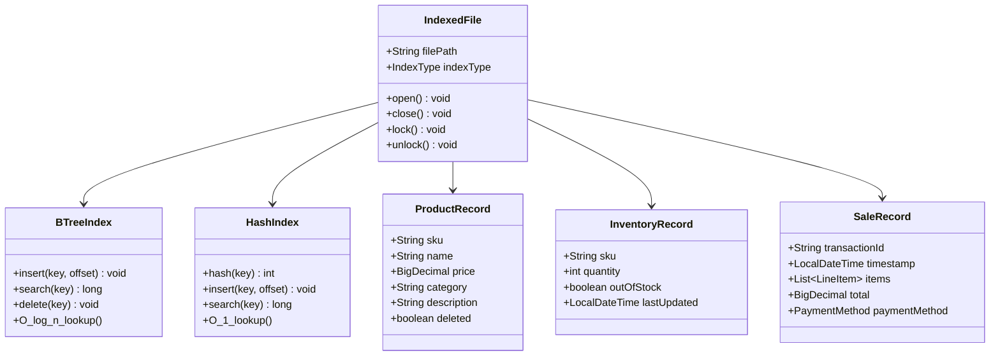
```mermaid
classDiagram
    class IndexedFile {
        +String filePath
        +IndexType indexType
        +open() void
        +close() void
        +lock() void
        +unlock() void
    }
 
    class BTreeIndex {
        +insert(key, offset) void
        +search(key) long
        +delete(key) void
        +O_log_n_lookup()
    }
 
    class HashIndex {
        +hash(key) int
        +insert(key, offset) void
        +search(key) long
        +O_1_lookup()
    }
 
    class ProductRecord {
        +String sku
        +String name
        +BigDecimal price
        +String category
        +String description
        +boolean deleted
    }
 
    class InventoryRecord {
        +String sku
        +int quantity
        +boolean outOfStock
        +LocalDateTime lastUpdated
    }
 
    class SaleRecord {
        +String transactionId
        +LocalDateTime timestamp
        +List~LineItem~ items
        +BigDecimal total
        +PaymentMethod paymentMethod
    }
 
    IndexedFile --> BTreeIndex
    IndexedFile --> HashIndex
    IndexedFile --> ProductRecord
    IndexedFile --> InventoryRecord
    IndexedFile --> SaleRecord
```
 
### Flujo de Datos: CRUD de Productos
 
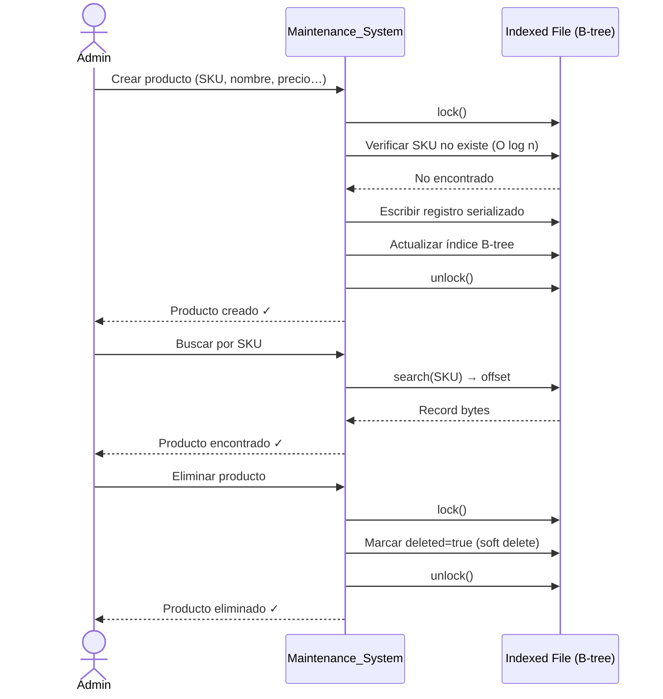
```mermaid
sequenceDiagram
    actor Admin
    participant MS as Maintenance_System
    participant IF as Indexed File (B-tree)
 
    Admin->>MS: Crear producto (SKU, nombre, precio…)
    MS->>IF: lock()
    MS->>IF: Verificar SKU no existe (O log n)
    IF-->>MS: No encontrado
    MS->>IF: Escribir registro serializado
    MS->>IF: Actualizar índice B-tree
    MS->>IF: unlock()
    MS-->>Admin: Producto creado ✓
 
    Admin->>MS: Buscar por SKU
    MS->>IF: search(SKU) → offset
    IF-->>MS: Record bytes
    MS-->>Admin: Producto encontrado ✓
 
    Admin->>MS: Eliminar producto
    MS->>IF: lock()
    MS->>IF: Marcar deleted=true (soft delete)
    MS->>IF: unlock()
    MS-->>Admin: Producto eliminado ✓
```
 
### Flujo de Datos: Sincronización TCP
 
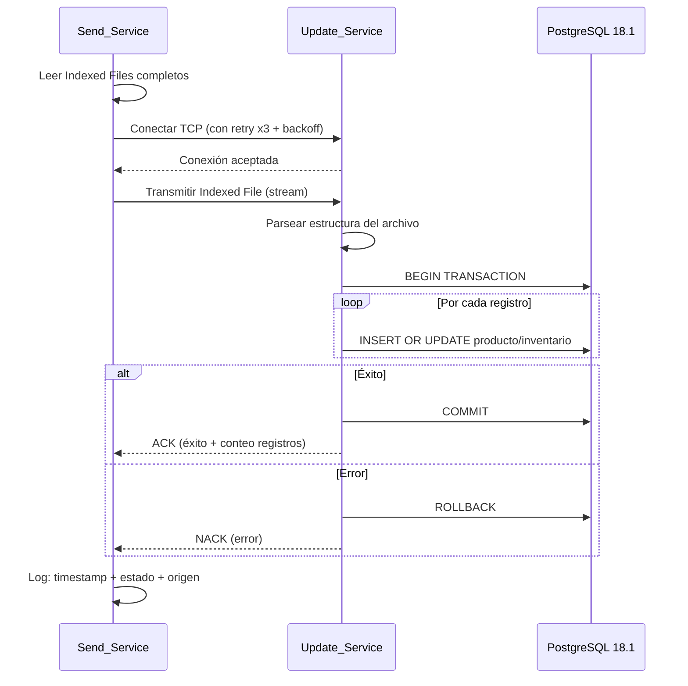
```mermaid
sequenceDiagram
    participant SS as Send_Service
    participant US as Update_Service
    participant DB as PostgreSQL 18.1
 
    SS->>SS: Leer Indexed Files completos
    SS->>US: Conectar TCP (con retry x3 + backoff)
    US-->>SS: Conexión aceptada
    SS->>US: Transmitir Indexed File (stream)
    US->>US: Parsear estructura del archivo
    US->>DB: BEGIN TRANSACTION
    loop Por cada registro
        US->>DB: INSERT OR UPDATE producto/inventario
    end
    alt Éxito
        US->>DB: COMMIT
        US-->>SS: ACK (éxito + conteo registros)
    else Error
        US->>DB: ROLLBACK
        US-->>SS: NACK (error)
    end
    SS->>SS: Log: timestamp + estado + origen
```
 
### Esquema de Base de Datos — Entregable 1
 
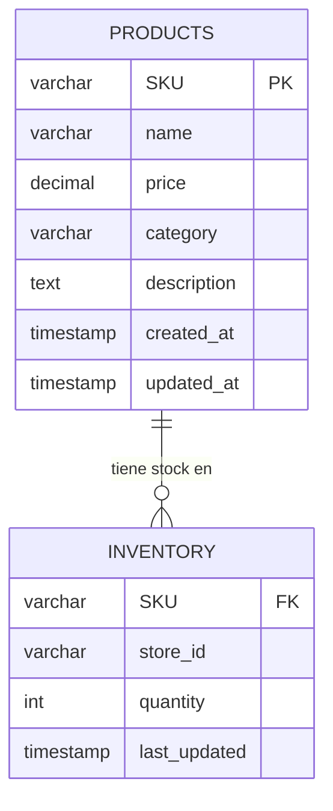
```mermaid
erDiagram
    PRODUCTS {
        varchar SKU PK
        varchar name
        decimal price
        varchar category
        text description
        timestamp created_at
        timestamp updated_at
    }
 
    INVENTORY {
        varchar SKU FK
        varchar store_id
        int quantity
        timestamp last_updated
    }
 
    PRODUCTS ||--o{ INVENTORY : "tiene stock en"
```
 
### Estructura de Módulos (Maven)
 
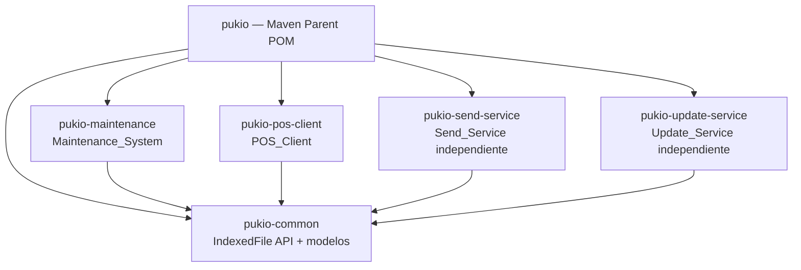
```mermaid
graph TD
    ROOT[pukio — Maven Parent POM]
    MS[pukio-maintenance<br/>Maintenance_System]
    PC[pukio-pos-client<br/>POS_Client]
    SS[pukio-send-service<br/>Send_Service independiente]
    US[pukio-update-service<br/>Update_Service independiente]
    COMMON[pukio-common<br/>IndexedFile API + modelos]
 
    ROOT --> MS
    ROOT --> PC
    ROOT --> SS
    ROOT --> US
    ROOT --> COMMON
 
    MS --> COMMON
    PC --> COMMON
    SS --> COMMON
    US --> COMMON
```
 
---
 
## Entregable 2 — Arquitectura Cliente/Servidor
 
### Descripción General
 
Se centraliza **toda la lógica de negocio** en el `Application_Server` (Spring Boot). El `POS_Client` pasa a ser un **cliente ligero** (solo UI). Se elimina el uso de archivos indexados locales. Se añade un `Analytics_Server` (Data Warehouse con esquema estrella) y visualización con **Apache Superset**.
 
### Diagrama de Despliegue
 
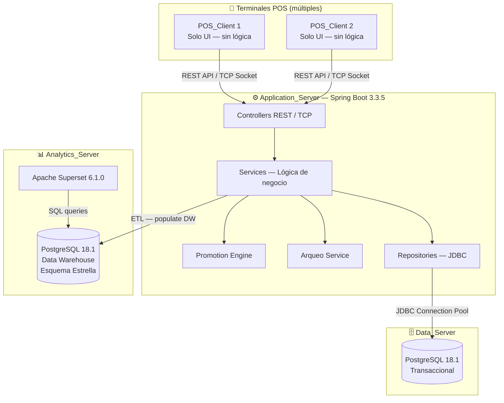
```mermaid
graph TB
    subgraph TIENDA["🏪 Terminales POS (múltiples)"]
        PC1[POS_Client 1<br/>Solo UI — sin lógica]
        PC2[POS_Client 2<br/>Solo UI — sin lógica]
    end
 
    subgraph SERVIDOR_APP["⚙️ Application_Server — Spring Boot 3.3.5"]
        direction TB
        CTRL[Controllers REST / TCP]
        SVC[Services — Lógica de negocio]
        PROMO[Promotion Engine]
        ARQUEO[Arqueo Service]
        REPO[Repositories — JDBC]
    end
 
    subgraph SERVIDOR_DATOS["🗄️ Data_Server"]
        DB[(PostgreSQL 18.1<br/>Transaccional)]
    end
 
    subgraph ANALYTICS["📊 Analytics_Server"]
        DW[(PostgreSQL 18.1<br/>Data Warehouse<br/>Esquema Estrella)]
        SUP[Apache Superset 6.1.0]
    end
 
    PC1 -->|REST API / TCP Socket| CTRL
    PC2 -->|REST API / TCP Socket| CTRL
    CTRL --> SVC
    SVC --> PROMO
    SVC --> ARQUEO
    SVC --> REPO
    REPO -->|JDBC Connection Pool| DB
    SVC -->|ETL — populate DW| DW
    SUP -->|SQL queries| DW
```
 
### Capas del Application_Server
 
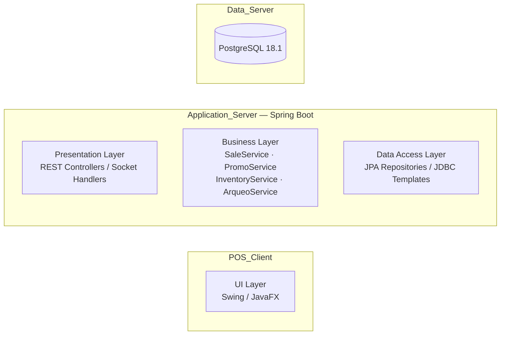
```mermaid
graph LR
    subgraph CLIENT["POS_Client"]
        UI[UI Layer<br/>Swing / JavaFX]
    end
 
    subgraph APP["Application_Server — Spring Boot"]
        PRES[Presentation Layer<br/>REST Controllers / Socket Handlers]
        BIZ[Business Layer<br/>SaleService · PromoService<br/>InventoryService · ArqueoService]
        DAL[Data Access Layer<br/>JPA Repositories / JDBC Templates]
    end
 
    subgraph DATA["Data_Server"]
        PGDB[(PostgreSQL 18.1)]
    end
```

```
    UI -->|HTTP/REST o TCP| PRES
```
### Diseño de la Interfaz Gráfica — POS_Client (Swing)

El `POS_Client` implementa una ventana de escritorio Java Swing organizada en los siguientes paneles de navegación, gestionados por un `CardLayout` en el área central:

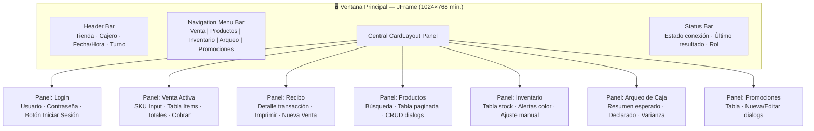
```mermaid
graph TD
    subgraph MAIN_WINDOW["🖥️ Ventana Principal — JFrame (1024×768 mín.)"]
        HEADER[Header Bar<br/>Tienda · Cajero · Fecha/Hora · Turno]
        NAV["Navigation Menu Bar<br/>Venta | Productos | Inventario | Arqueo | Promociones"]
        CARD[Central CardLayout Panel]
        STATUS[Status Bar<br/>Estado conexión · Último resultado · Rol]
    end

    CARD --> P_LOGIN[Panel: Login<br/>Usuario · Contraseña · Botón Iniciar Sesión]
    CARD --> P_SALE[Panel: Venta Activa<br/>SKU Input · Tabla ítems · Totales · Cobrar]
    CARD --> P_RECEIPT[Panel: Recibo<br/>Detalle transacción · Imprimir · Nueva Venta]
    CARD --> P_PRODUCTS[Panel: Productos<br/>Búsqueda · Tabla paginada · CRUD dialogs]
    CARD --> P_INVENTORY[Panel: Inventario<br/>Tabla stock · Alertas color · Ajuste manual]
    CARD --> P_ARQUEO[Panel: Arqueo de Caja<br/>Resumen esperado · Declarado · Varianza]
    CARD --> P_PROMOS[Panel: Promociones<br/>Tabla · Nueva/Editar dialogs]
```

**Layout del Panel de Venta Activa (panel principal)**
# UI Specifications - POS Checkout Screen

## Layout Wireframe
```text
┌─────────────────────────────────────────────────────────────────┐
│  HEADER: [Tienda: Lima Norte]  [Cajero: Juan][10:45:23][T1]     │
├────────────────────────────────────┬────────────────────────────┤
│  SKU: [___] [Agregar]              │  Subtotal:    S/. 0.00     │
│                                    │  Descuento:   S/. 0.00     │
│  ┌──────────────────────────────┐  │  IGV (18%):   S/. 0.00     │
│  │SKU │Nombre│Cant│P.Unit│Sub   │  │  ───────────────────────── │
│  ├────┼──────┼────┼──────┼──────┤  │  TOTAL:      S/. 0.00      │
│  │    │      │    │      │ [X]  │  │                            │
│  │    │      │    │      │ [X]  │  │  Método: [Efectivo    ▼]   │
│  └──────────────────────────────┘  │  Monto:  [________]        │
│                                    │  Vuelto: S/. 0.00          │
│  [Cancelar Venta]                  │  [Pago Dividido]  [Cobrar] │
├────────────────────────────────────┴────────────────────────────┤
│  STATUS: [● CONECTADO]  [Última op: OK]  [Rol: Cajero]          │
└─────────────────────────────────────────────────────────────────┘
```

**Clases UI principales (paquete `com.pukio.posclient.ui`)**

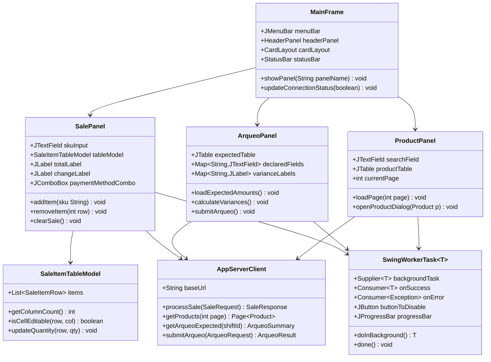
```mermaid
classDiagram
    class MainFrame {
        +JMenuBar menuBar
        +HeaderPanel headerPanel
        +CardLayout cardLayout
        +StatusBar statusBar
        +showPanel(String panelName) void
        +updateConnectionStatus(boolean) void
    }

    class SalePanel {
        +JTextField skuInput
        +SaleItemTableModel tableModel
        +JLabel totalLabel
        +JLabel changeLabel
        +JComboBox paymentMethodCombo
        +addItem(sku String) void
        +removeItem(int row) void
        +clearSale() void
    }

    class SaleItemTableModel {
        +List~SaleItemRow~ items
        +getColumnCount() int
        +isCellEditable(row, col) boolean
        +updateQuantity(row, qty) void
    }

    class ArqueoPanel {
        +JTable expectedTable
        +Map~String,JTextField~ declaredFields
        +Map~String,JLabel~ varianceLabels
        +loadExpectedAmounts() void
        +calculateVariances() void
        +submitArqueo() void
    }

    class ProductPanel {
        +JTextField searchField
        +JTable productTable
        +int currentPage
        +loadPage(int page) void
        +openProductDialog(Product p) void
    }

    class AppServerClient {
        +String baseUrl
        +processSale(SaleRequest) SaleResponse
        +getProducts(int page) Page~Product~
        +getArqueoExpected(shiftId) ArqueoSummary
        +submitArqueo(ArqueoRequest) ArqueoResult
    }

    class SwingWorkerTask~T~ {
        +Supplier~T~ backgroundTask
        +Consumer~T~ onSuccess
        +Consumer~Exception~ onError
        +JButton buttonToDisable
        +JProgressBar progressBar
        +doInBackground() T
        +done() void
    }

    MainFrame --> SalePanel
    MainFrame --> ArqueoPanel
    MainFrame --> ProductPanel
    SalePanel --> SaleItemTableModel
    SalePanel --> AppServerClient
    ArqueoPanel --> AppServerClient
    ProductPanel --> AppServerClient
    SalePanel --> SwingWorkerTask
    ArqueoPanel --> SwingWorkerTask
    ProductPanel --> SwingWorkerTask
```
```
    PRES --> BIZ
    BIZ --> DAL
    DAL -->|JDBC Pool| PGDB
```
 
### Flujo de Venta Completo
 
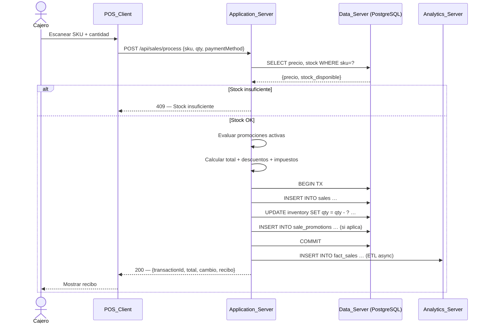
```mermaid
sequenceDiagram
    actor Cajero
    participant PC as POS_Client
    participant AS as Application_Server
    participant DB as Data_Server (PostgreSQL)
    participant DW as Analytics_Server
 
    Cajero->>PC: Escanear SKU + cantidad
    PC->>AS: POST /api/sales/process {sku, qty, paymentMethod}
    AS->>DB: SELECT precio, stock WHERE sku=?
    DB-->>AS: {precio, stock_disponible}
    alt Stock insuficiente
        AS-->>PC: 409 — Stock insuficiente
    else Stock OK
        AS->>AS: Evaluar promociones activas
        AS->>AS: Calcular total + descuentos + impuestos
        AS->>DB: BEGIN TX
        AS->>DB: INSERT INTO sales …
        AS->>DB: UPDATE inventory SET qty = qty - ? …
        AS->>DB: INSERT INTO sale_promotions … (si aplica)
        AS->>DB: COMMIT
        AS->>DW: INSERT INTO fact_sales … (ETL async)
        AS-->>PC: 200 — {transactionId, total, cambio, recibo}
        PC-->>Cajero: Mostrar recibo
    end
```
 
### Flujo de Arqueo de Caja
 
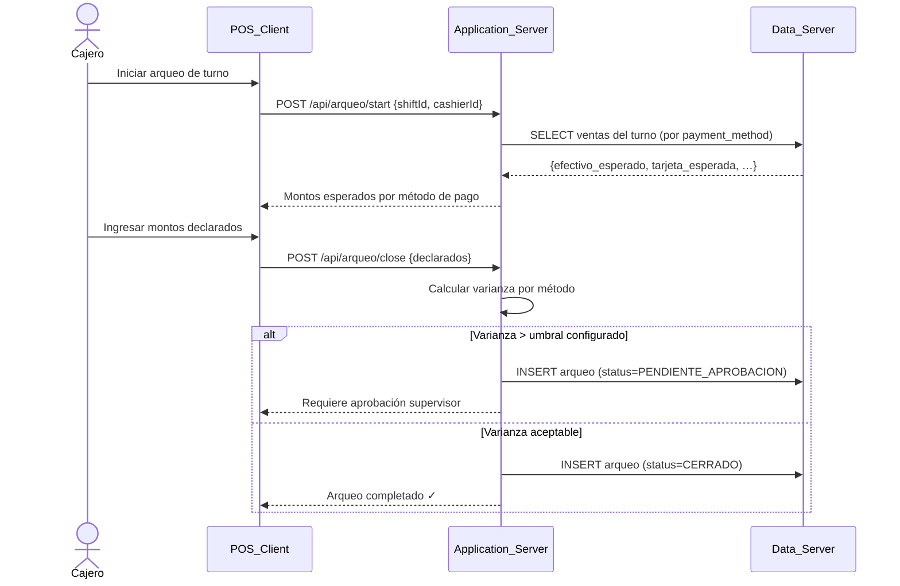
```mermaid
sequenceDiagram
    actor Cajero
    participant PC as POS_Client
    participant AS as Application_Server
    participant DB as Data_Server
 
    Cajero->>PC: Iniciar arqueo de turno
    PC->>AS: POST /api/arqueo/start {shiftId, cashierId}
    AS->>DB: SELECT ventas del turno (por payment_method)
    DB-->>AS: {efectivo_esperado, tarjeta_esperada, …}
    AS-->>PC: Montos esperados por método de pago
    Cajero->>PC: Ingresar montos declarados
    PC->>AS: POST /api/arqueo/close {declarados}
    AS->>AS: Calcular varianza por método
    alt Varianza > umbral configurado
        AS->>DB: INSERT arqueo (status=PENDIENTE_APROBACION)
        AS-->>PC: Requiere aprobación supervisor
    else Varianza aceptable
        AS->>DB: INSERT arqueo (status=CERRADO)
        AS-->>PC: Arqueo completado ✓
    end
```
 
### Modelo de Data Warehouse (Esquema Estrella)
 
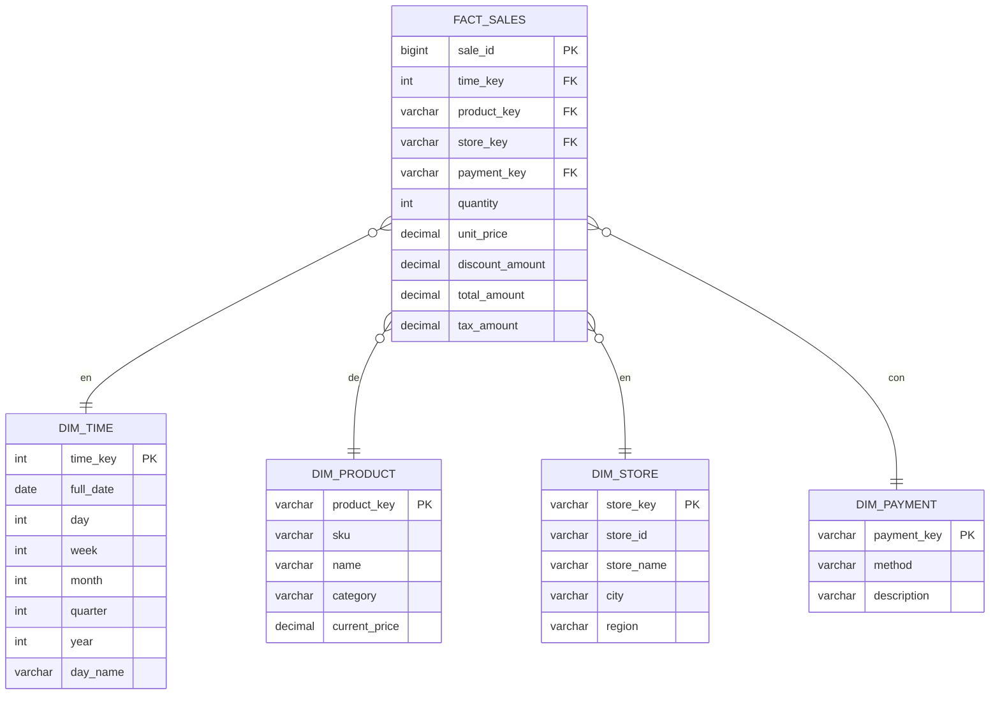
```mermaid
erDiagram
    FACT_SALES {
        bigint sale_id PK
        int time_key FK
        varchar product_key FK
        varchar store_key FK
        varchar payment_key FK
        int quantity
        decimal unit_price
        decimal discount_amount
        decimal total_amount
        decimal tax_amount
    }
 
    DIM_TIME {
        int time_key PK
        date full_date
        int day
        int week
        int month
        int quarter
        int year
        varchar day_name
    }
 
    DIM_PRODUCT {
        varchar product_key PK
        varchar sku
        varchar name
        varchar category
        decimal current_price
    }
 
    DIM_STORE {
        varchar store_key PK
        varchar store_id
        varchar store_name
        varchar city
        varchar region
    }
 
    DIM_PAYMENT {
        varchar payment_key PK
        varchar method
        varchar description
    }
 
    FACT_SALES }o--|| DIM_TIME : "en"
    FACT_SALES }o--|| DIM_PRODUCT : "de"
    FACT_SALES }o--|| DIM_STORE : "en"
    FACT_SALES }o--|| DIM_PAYMENT : "con"
```
 
---
 
## Entregable 3 — Arquitectura N-Capas
 
### Descripción General
 
Se formaliza la separación en **tres capas independientes** (Presentación, Negocio, Acceso a Datos), se añade **balanceo de carga** con Nginx, **alta disponibilidad** mediante un `Mirror_Server` con streaming replication de PostgreSQL, un **FTP Server** (vsftpd/ProFTPD) para imágenes y auditoría fiscal, y monitoreo proactivo de salud.
 
### Diagrama de Despliegue N-Capas
 
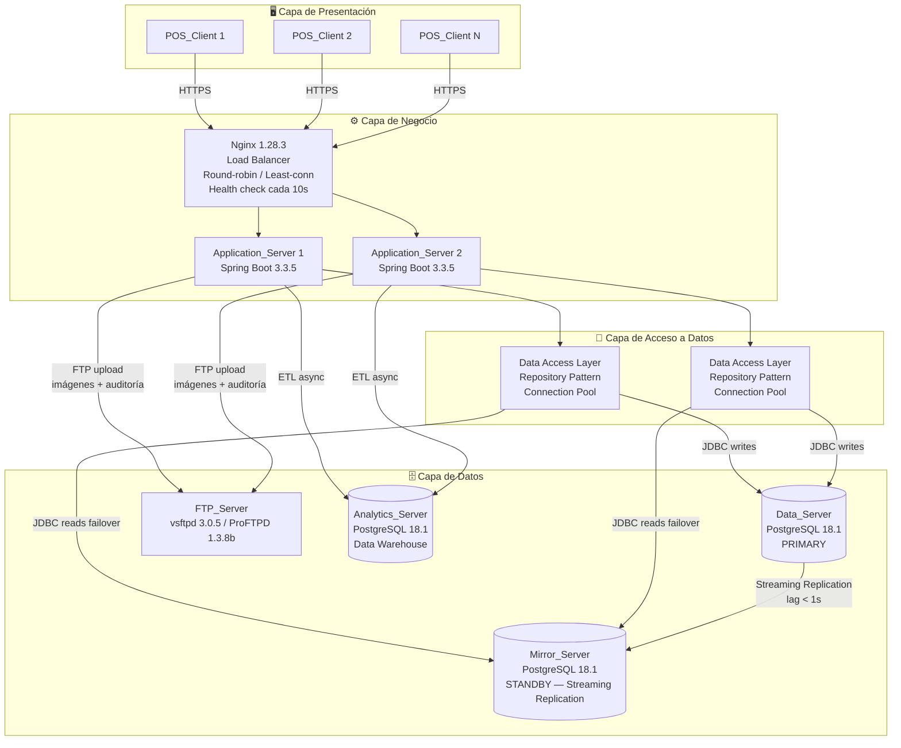
```mermaid
graph TB
    subgraph CAPA_PRES["🖥️ Capa de Presentación"]
        PC1[POS_Client 1]
        PC2[POS_Client 2]
        PCN[POS_Client N]
    end
 
    subgraph CAPA_NEG["⚙️ Capa de Negocio"]
        LB[Nginx 1.28.3<br/>Load Balancer<br/>Round-robin / Least-conn<br/>Health check cada 10s]
        AS1[Application_Server 1<br/>Spring Boot 3.3.5]
        AS2[Application_Server 2<br/>Spring Boot 3.3.5]
    end
 
    subgraph CAPA_DAL["🔌 Capa de Acceso a Datos"]
        DAL1[Data Access Layer<br/>Repository Pattern<br/>Connection Pool]
        DAL2[Data Access Layer<br/>Repository Pattern<br/>Connection Pool]
    end
 
    subgraph CAPA_DATOS["🗄️ Capa de Datos"]
        DS[(Data_Server<br/>PostgreSQL 18.1<br/>PRIMARY)]
        MS_DB[(Mirror_Server<br/>PostgreSQL 18.1<br/>STANDBY — Streaming Replication)]
        FTP[FTP_Server<br/>vsftpd 3.0.5 / ProFTPD 1.3.8b]
        DW[(Analytics_Server<br/>PostgreSQL 18.1<br/>Data Warehouse)]
    end
 
    PC1 & PC2 & PCN -->|HTTPS| LB
    LB --> AS1
    LB --> AS2
    AS1 --> DAL1
    AS2 --> DAL2
    DAL1 & DAL2 -->|JDBC writes| DS
    DAL1 & DAL2 -->|JDBC reads failover| MS_DB
    DS -->|Streaming Replication<br/>lag < 1s| MS_DB
    AS1 & AS2 -->|FTP upload<br/>imágenes + auditoría| FTP
    AS1 & AS2 -->|ETL async| DW
```
 
### Mecanismo de Failover
 
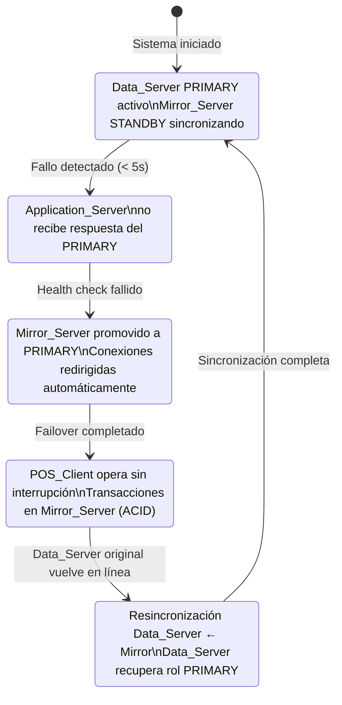
```mermaid
stateDiagram-v2
    [*] --> NORMAL : Sistema iniciado
    NORMAL : Data_Server PRIMARY activo\nMirror_Server STANDBY sincronizando
    NORMAL --> DETECTANDO : Fallo detectado (< 5s)
    DETECTANDO : Application_Server\nno recibe respuesta del PRIMARY
    DETECTANDO --> FAILOVER : Health check fallido
    FAILOVER : Mirror_Server promovido a PRIMARY\nConexiones redirigidas automáticamente
    FAILOVER --> OPERANDO_EN_MIRROR : Failover completado
    OPERANDO_EN_MIRROR : POS_Client opera sin interrupción\nTransacciones en Mirror_Server (ACID)
    OPERANDO_EN_MIRROR --> RECUPERACION : Data_Server original vuelve en línea
    RECUPERACION : Resincronización Data_Server ← Mirror\nData_Server recupera rol PRIMARY
    RECUPERACION --> NORMAL : Sincronización completa
```
 
### Capas Lógicas (Separación Estricta)
 
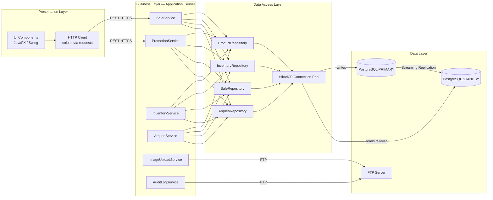
```mermaid
graph LR
    subgraph PL["Presentation Layer"]
        UI_COMP[UI Components<br/>JavaFX / Swing]
        HTTP_CLIENT[HTTP Client<br/>solo envía requests]
    end
 
    subgraph BL["Business Layer — Application_Server"]
        SALE_SVC[SaleService]
        PROMO_SVC[PromotionService]
        INV_SVC[InventoryService]
        ARQUEO_SVC[ArqueoService]
        IMG_SVC[ImageUploadService]
        AUDIT_SVC[AuditLogService]
    end
 
    subgraph DAL["Data Access Layer"]
        PROD_REPO[ProductRepository]
        INV_REPO[InventoryRepository]
        SALE_REPO[SaleRepository]
        ARQUEO_REPO[ArqueoRepository]
        CONN_POOL[HikariCP Connection Pool]
    end
 
    subgraph DL["Data Layer"]
        PG[(PostgreSQL PRIMARY)]
        MIRROR[(PostgreSQL STANDBY)]
        FTP_SRV[FTP Server]
    end
 
    UI_COMP --> HTTP_CLIENT
    HTTP_CLIENT -->|REST HTTPS| SALE_SVC & PROMO_SVC
    SALE_SVC & PROMO_SVC & INV_SVC & ARQUEO_SVC --> PROD_REPO & INV_REPO & SALE_REPO & ARQUEO_REPO
    IMG_SVC & AUDIT_SVC -->|FTP| FTP_SRV
    PROD_REPO & INV_REPO & SALE_REPO & ARQUEO_REPO --> CONN_POOL
    CONN_POOL -->|writes| PG
    CONN_POOL -->|reads failover| MIRROR
    PG -->|Streaming Replication| MIRROR
```
 
### Estructura de Directorios FTP
 
```mermaid
graph TD
    FTP_ROOT[/ — FTP Root]
    FTP_ROOT --> IMAGES[/images/]
    FTP_ROOT --> BACKUPS[/backups/]
    FTP_ROOT --> AUDIT[/audit-logs/]
 
    IMAGES --> SKU1[/images/SKU-001/]
    IMAGES --> SKU2[/images/SKU-002/]
    SKU1 --> IMG1[product.jpg]
    SKU1 --> IMG2[thumbnail.jpg]
 
    BACKUPS --> BDATE[/backups/2025/01/15/]
    BDATE --> ARQ1[arqueo_store01_T08.json]
    BDATE --> ARQ2[arqueo_store02_T08.json]
 
    AUDIT --> ADATE[/audit-logs/2025/01/15/]
    ADATE --> LOG1[store01_tx_001.xml]
    ADATE --> LOG2[store01_tx_002.xml]
```
 
### Monitoreo de Salud
 
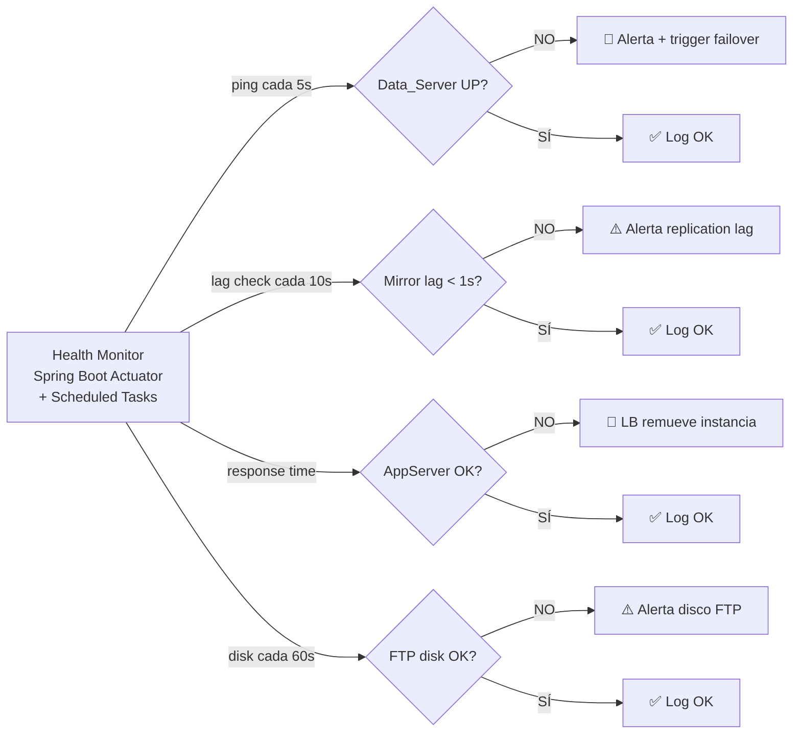
```mermaid
graph LR
    MONITOR[Health Monitor<br/>Spring Boot Actuator<br/>+ Scheduled Tasks]
 
    MONITOR -->|"ping cada 5s"| DS_CHECK{Data_Server UP?}
    MONITOR -->|"lag check cada 10s"| MIR_CHECK{Mirror lag < 1s?}
    MONITOR -->|"response time"| AS_CHECK{AppServer OK?}
    MONITOR -->|"disk cada 60s"| FTP_CHECK{FTP disk OK?}
 
    DS_CHECK -->|NO| ALERT1[🚨 Alerta + trigger failover]
    MIR_CHECK -->|NO| ALERT2[⚠️ Alerta replication lag]
    AS_CHECK -->|NO| ALERT3[🚨 LB remueve instancia]
    FTP_CHECK -->|NO| ALERT4[⚠️ Alerta disco FTP]
 
    DS_CHECK -->|SÍ| LOG1[✅ Log OK]
    MIR_CHECK -->|SÍ| LOG2[✅ Log OK]
    AS_CHECK -->|SÍ| LOG3[✅ Log OK]
    FTP_CHECK -->|SÍ| LOG4[✅ Log OK]
```
 
---
 
## Entregable 4 — Cloud Computing
 
### Descripción General
 
El sistema se **cloud-nativiza** completamente: todos los componentes se contienen en **Docker 29.2.0** y se orquestan con **Kubernetes (Minikube v1.38.1)**. Se implementa auto-escalado (**HPA**), almacenamiento de objetos con **MinIO**, gestión de identidad con **Keycloak**, monitoreo con **Prometheus + Grafana**, logs centralizados con **ELK Stack / Loki**, y seguridad con **Let's Encrypt + iptables**.
 
### Arquitectura Cloud General
 
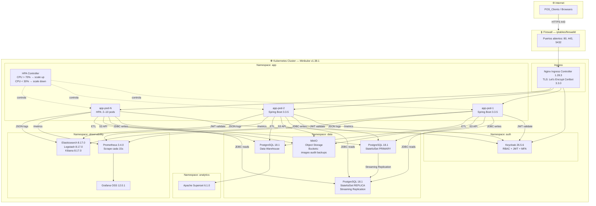
```mermaid
graph TB
    subgraph INTERNET["🌐 Internet"]
        CLIENTS[POS_Clients / Browsers]
    end
 
    subgraph FIREWALL["🔒 Firewall — iptables/firewalld"]
        FW[Puertos abiertos: 80, 443, 5432]
    end
 
    subgraph K8S["☸️ Kubernetes Cluster — Minikube v1.38.1"]
        subgraph INGRESS["Ingress"]
            NGINX_ING[Nginx Ingress Controller 1.28.3<br/>TLS: Let's Encrypt Certbot 3.3.0]
        end
 
        subgraph AUTH["Namespace: auth"]
            KC[Keycloak 26.5.6<br/>RBAC + JWT + MFA]
        end
 
        subgraph APP["Namespace: app"]
            AS_POD1[app-pod-1<br/>Spring Boot 3.3.5]
            AS_POD2[app-pod-2<br/>Spring Boot 3.3.5]
            AS_PODN[app-pod-N<br/>HPA: 2–10 pods]
            HPA_CTRL[HPA Controller<br/>CPU > 70% → scale up<br/>CPU < 30% → scale down]
        end
 
        subgraph DATA["Namespace: data"]
            PG_PRIMARY[PostgreSQL 18.1<br/>StatefulSet PRIMARY]
            PG_REPLICA[PostgreSQL 18.1<br/>StatefulSet REPLICA<br/>Streaming Replication]
            DW_DB[PostgreSQL 18.1<br/>Data Warehouse]
            MINIO[MinIO<br/>Object Storage<br/>Buckets: images·audit·backups]
        end
 
        subgraph ANALYTICS["Namespace: analytics"]
            SUPERSET[Apache Superset 6.1.0]
        end
 
        subgraph OBSERV["Namespace: observability"]
            PROM[Prometheus 3.4.0<br/>Scrape cada 15s]
            GRAFANA[Grafana OSS 12.0.1]
            ELK[Elasticsearch 8.17.0<br/>Logstash 8.17.0<br/>Kibana 8.17.0]
        end
    end
 
    CLIENTS -->|HTTPS 443| FIREWALL
    FW --> NGINX_ING
    NGINX_ING --> KC
    NGINX_ING --> AS_POD1 & AS_POD2 & AS_PODN
    AS_POD1 & AS_POD2 & AS_PODN -->|JWT validate| KC
    AS_POD1 & AS_POD2 & AS_PODN -->|JDBC writes| PG_PRIMARY
    AS_POD1 & AS_POD2 & AS_PODN -->|JDBC reads| PG_REPLICA
    AS_POD1 & AS_POD2 & AS_PODN -->|S3 API| MINIO
    AS_POD1 & AS_POD2 & AS_PODN -->|ETL| DW_DB
    PG_PRIMARY -->|Streaming Replication| PG_REPLICA
    DW_DB --> SUPERSET
    AS_POD1 & AS_POD2 & AS_PODN -->|/metrics| PROM
    PROM --> GRAFANA
    AS_POD1 & AS_POD2 & AS_PODN -->|JSON logs| ELK
    HPA_CTRL -.->|controla| AS_POD1 & AS_POD2 & AS_PODN
```
 
### Recursos Kubernetes
 
```mermaid
graph TD
    subgraph K8S_RESOURCES["Recursos Kubernetes — pukio"]
 
        subgraph DEPLOY["Deployments"]
            D_APP[Deployment: pukio-app<br/>replicas: 2–10 · image: pukio-app:latest]
            D_KC[Deployment: keycloak<br/>replicas: 1]
            D_SUP[Deployment: superset<br/>replicas: 1]
            D_PROM[Deployment: prometheus<br/>replicas: 1]
            D_GRAF[Deployment: grafana<br/>replicas: 1]
        end
 
        subgraph STATEFUL["StatefulSets"]
            SS_PG[StatefulSet: postgres-primary<br/>PVC: 50Gi]
            SS_REP[StatefulSet: postgres-replica<br/>PVC: 50Gi]
            SS_DW[StatefulSet: postgres-dw<br/>PVC: 100Gi]
            SS_MINIO[StatefulSet: minio<br/>PVC: 200Gi]
        end
 
        subgraph SCALING["Auto-Scaling"]
            HPA[HPA: pukio-app<br/>min:2 max:10<br/>targetCPU: 70%]
            CRON[CronJob: pre-scale<br/>Black Friday / Navidad]
        end
 
        subgraph CONFIG["ConfigMaps & Secrets"]
            CM[ConfigMap: pukio-config<br/>DB_URL, APP_PORT, FTP_HOST…]
            SEC[Secret: pukio-secrets<br/>DB_PASSWORD, JWT_SECRET…]
        end
 
        subgraph NS["Namespaces"]
            NS_APP[namespace: app]
            NS_DATA[namespace: data]
            NS_AUTH[namespace: auth]
            NS_OBS[namespace: observability]
        end
    end
```
 
### Flujo de Autenticación con Keycloak
 
```mermaid
sequenceDiagram
    actor Usuario
    participant PC as POS_Client
    participant KC as Keycloak 26.5.6
    participant AS as Application_Server
    participant DB as Data_Server
 
    Usuario->>PC: Login (usuario + password)
    PC->>KC: POST /realms/pukio/protocol/openid-connect/token
    KC->>KC: Validar credenciales + política contraseña
    alt MFA requerido (Admin)
        KC-->>PC: Solicitar segundo factor
        Usuario->>PC: Ingresar código TOTP
        PC->>KC: Enviar código TOTP
    end
    KC-->>PC: JWT Access Token + Refresh Token
    PC->>AS: POST /api/sales {payload} + Authorization: Bearer JWT
    AS->>KC: Validar JWT (public key / introspect)
    KC-->>AS: Token válido + roles [cashier]
    AS->>AS: Verificar permiso RBAC para operación
    AS->>DB: Ejecutar operación
    DB-->>AS: Resultado
    AS-->>PC: Respuesta
```
 
### Pipeline CI/CD y Contenedores Docker
 
```mermaid
graph LR
    subgraph BUILD["Build — Maven 3.9.9"]
        SRC[Código Fuente Java 21]
        MVN[mvn package<br/>multi-stage Dockerfile]
        IMG[Docker Image<br/>pukio-app:tag]
    end
 
    subgraph REGISTRY["Container Registry<br/>(Docker Hub / local)"]
        REG[Image Registry]
    end
 
    subgraph K8S_DEPLOY["Deploy — Minikube"]
        APPLY[kubectl apply -f k8s/]
        PODS[Pods actualizados<br/>rolling update]
    end
 
    SRC --> MVN --> IMG --> REG --> APPLY --> PODS
```
 
### Observabilidad: Prometheus + Grafana
 
```mermaid
graph TB
    subgraph SOURCES["Fuentes de Métricas"]
        APP_MET[Application_Server<br/>GET /actuator/prometheus]
        PG_MET[postgres-exporter]
        K8S_MET[kube-state-metrics]
        NODE_MET[node-exporter]
    end
 
    subgraph COLLECTION["Prometheus 3.4.0"]
        SCRAPE[Scrape cada 15s]
        TSDB[(TSDB — Time Series DB)]
        RULES[Alert Rules<br/>CPU>70%·Error>5%·Latency>2s<br/>Replication lag>10s]
    end
 
    subgraph VIZ["Grafana OSS 12.0.1"]
        DASH_SYS[Dashboard: System Overview]
        DASH_APP[Dashboard: App Performance]
        DASH_DB[Dashboard: DB Performance]
        ALERTS[Alerting<br/>Email / Webhook / Slack]
    end
 
    APP_MET & PG_MET & K8S_MET & NODE_MET --> SCRAPE
    SCRAPE --> TSDB
    TSDB --> RULES
    RULES -->|dispara| ALERTS
    TSDB --> DASH_SYS & DASH_APP & DASH_DB
```
 
### Gestión de Logs con ELK Stack
 
```mermaid
graph LR
    subgraph PODS["Application Pods"]
        POD1[app-pod-1<br/>JSON logs]
        POD2[app-pod-2<br/>JSON logs]
        PODN[app-pod-N<br/>JSON logs]
    end
 
    subgraph ELK["ELK Stack 8.17.0"]
        LS[Logstash<br/>Parse + enrich + filter]
        ES[(Elasticsearch<br/>Índice por fecha<br/>Retención 30 días)]
        KIB[Kibana<br/>Search + Dashboards<br/>Filtros: level·pod·store]
    end
 
    POD1 & POD2 & PODN -->|stdout JSON| LS
    LS --> ES
    ES --> KIB
```
 
### Estrategia de Respaldo con MinIO
 
```mermaid
graph TB
    subgraph BACKUP["Backup Strategy"]
        CRON_BACK[CronJob: daily-backup<br/>pg_dump comprimido + cifrado]
        CRON_VERIFY[CronJob: verify-backup<br/>Verificar integridad]
        CRON_RESTORE[CronJob: monthly-restore-test<br/>Test mensual]
    end
 
    subgraph MINIO_BUCKETS["MinIO Buckets"]
        B_IMAGES[product-images/<br/>Acceso público con pre-signed URL]
        B_AUDIT[audit-logs/<br/>Acceso autenticado<br/>Versionado ON<br/>Retención 5 años]
        B_BACKUP[backups/<br/>daily/weekly/monthly<br/>Cifrado + comprimido]
    end
 
    subgraph RETENTION["Política de Retención"]
        R1[Diario: 7 días]
        R2[Semanal: 4 semanas]
        R3[Mensual: 12 meses]
    end
 
    CRON_BACK -->|full semanal<br/>incremental diario| B_BACKUP
    CRON_VERIFY --> B_BACKUP
    CRON_RESTORE --> B_BACKUP
    B_BACKUP --> R1 & R2 & R3
```
 
### Plan de Recuperación ante Desastres
 
```mermaid
graph LR
    subgraph PRIMARY["Zona Primaria"]
        P_K8S[Kubernetes Cluster\nPRIMARY]
        P_PG[PostgreSQL PRIMARY]
        P_MINIO[MinIO PRIMARY]
    end
 
    subgraph SECONDARY["Zona Secundaria (Standby)"]
        S_K8S[Kubernetes Cluster\nSTANDBY]
        S_PG[PostgreSQL REPLICA]
        S_MINIO[MinIO REPLICA]
    end
 
    P_PG -->|"Streaming Replication\nRPO < 15 min"| S_PG
    P_MINIO -->|"Object Replication"| S_MINIO
 
    FAILURE[❌ Fallo Zona Primaria] -->|Trigger failover| FAILOVER_PROC
    FAILOVER_PROC[Failover Automático\nRTO < 1 hora] --> S_K8S
    S_K8S --> S_PG
    S_K8S --> S_MINIO
```
 
---
 
## Modelo de Datos Común
 
Esquema relacional completo que aplica desde el Entregable 2 en adelante.
 
```mermaid
erDiagram
    PRODUCTS {
        varchar sku PK
        varchar name
        text description
        decimal price
        varchar category
        boolean active
        timestamp created_at
        timestamp updated_at
    }
 
    INVENTORY {
        bigint id PK
        varchar sku FK
        varchar store_id FK
        int quantity
        int reorder_point
        timestamp last_updated
        varchar last_updated_by
    }
 
    STORES {
        varchar store_id PK
        varchar name
        varchar city
        varchar region
        boolean active
    }
 
    SALES {
        bigint sale_id PK
        varchar store_id FK
        varchar cashier_id FK
        varchar shift_id
        timestamp sale_date
        decimal subtotal
        decimal discount_total
        decimal tax_total
        decimal grand_total
        varchar status
    }
 
    SALE_ITEMS {
        bigint item_id PK
        bigint sale_id FK
        varchar sku FK
        int quantity
        decimal unit_price
        decimal discount_amount
        decimal line_total
    }
 
    PAYMENTS {
        bigint payment_id PK
        bigint sale_id FK
        varchar method
        decimal amount
        varchar reference
    }
 
    PROMOTIONS {
        bigint promo_id PK
        varchar name
        varchar type
        decimal value
        decimal min_purchase
        varchar scope
        date start_date
        date end_date
        boolean active
    }
 
    ARQUEO {
        bigint arqueo_id PK
        varchar store_id FK
        varchar cashier_id FK
        varchar shift_id
        timestamp arqueo_date
        decimal cash_expected
        decimal cash_declared
        decimal cash_variance
        decimal card_expected
        decimal card_declared
        decimal card_variance
        varchar status
        varchar approved_by
    }
 
    USERS {
        varchar user_id PK
        varchar username
        varchar role
        varchar store_id FK
        boolean active
    }
 
    AUDIT_LOG {
        bigint log_id PK
        varchar user_id FK
        varchar operation
        varchar entity
        varchar entity_id
        text before_value
        text after_value
        timestamp log_date
        varchar ip_address
    }
 
    PRODUCTS ||--o{ INVENTORY : "stock en tienda"
    STORES ||--o{ INVENTORY : "tiene"
    STORES ||--o{ SALES : "genera"
    SALES ||--o{ SALE_ITEMS : "contiene"
    SALES ||--o{ PAYMENTS : "pagado con"
    PRODUCTS ||--o{ SALE_ITEMS : "incluido en"
    STORES ||--o{ ARQUEO : "realiza"
    STORES ||--o{ USERS : "pertenece"
```
 
---
 
## Requisitos Transversales
 
### Roles y Permisos (RBAC)
 
```mermaid
graph TD
    AUDITOR[👁️ Auditor<br/>Solo lectura: datos + audit logs]
    CASHIER[🛒 Cajero<br/>Ventas · Ver productos · Arqueo]
    SUPERVISOR[👔 Supervisor<br/>+ Aprobar arqueo · Ajustar inventario]
    MANAGER[📊 Gerente<br/>+ Gestionar productos · Reportes · Promociones]
    ADMIN[⚙️ Administrador<br/>+ Gestionar usuarios · Configurar sistema]
 
    CASHIER -->|hereda| SUPERVISOR
    SUPERVISOR -->|hereda| MANAGER
    MANAGER -->|hereda| ADMIN
```
 
### Manejo de Errores Transversal
 
```mermaid
flowchart TD
    OP[Operación del Sistema]
    OP --> ERR{¿Error?}
    ERR -->|Red| NET[Reintentar x3\ncon backoff exponencial]
    ERR -->|BD| DB_ERR[ROLLBACK transacción\nLog error + stack trace]
    ERR -->|Venta interrumpida| RESUME[Permitir reanudar\no cancelar TX]
 
    NET --> RETRY{¿Éxito tras retries?}
    RETRY -->|Sí| OK[✅ Operación completada]
    RETRY -->|No| USER_MSG[Mensaje de error\namigable al usuario]
 
    DB_ERR --> LOG[Log centralizado\ncon correlation ID]
    RESUME --> INTEGRITY[Mantener integridad\ntransaccional]
```
 
### Seguridad de Red
 
```mermaid
graph LR
    subgraph PUERTOS["Puertos Permitidos — iptables/firewalld"]
        P80[80 HTTP → redirect HTTPS]
        P443[443 HTTPS — TLS 1.2+]
        P5432[5432 PostgreSQL — solo red interna]
    end
 
    subgraph TLS["TLS — Let's Encrypt Certbot 3.3.0"]
        CERT[Certificado SSL/TLS]
        RENEW[Auto-renovación\nantes de expirar]
        WEAK[Deshabilitar\ncipher suites débiles]
    end
 
    subgraph K8S_NET["Kubernetes NetworkPolicy"]
        NP_APP[app → data: JDBC 5432]
        NP_AUTH[app → auth: OIDC 8080]
        NP_OBS[observability → app: scrape 8080]
        DENY[DEFAULT DENY ALL]
    end
 
    DENY --> NP_APP & NP_AUTH & NP_OBS
```
 
---
 
*Documento generado para el proyecto **Pukio** — Sistema POS Minorista*
*Stack: Oracle JDK 21 · Spring Boot 3.3.5 · PostgreSQL 18.1 · Maven 3.9.9 · Docker 29.2.0 · Minikube v1.38.1*
*Todas las tecnologías son 100% gratuitas y open-source.*
 