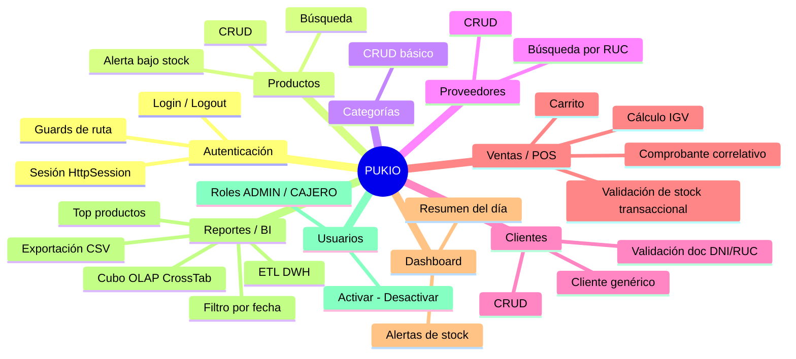

# Requisitos Funcionales — PUKIO (Sistema POS Web)

> Documento generado a partir del análisis estático del código fuente del proyecto **PUKIO**: backend Java 21 + Jakarta Servlets, frontend JavaScript vanilla, y base de datos Oracle 21c XE (esquemas `PUKIO_DB` y `PUKIO_DWH`).
>
> Cada requisito sigue el formato: **Como** `<rol>` **quiero** `<funcionalidad>` **para** `<valor/beneficio>`.

---

## 1. Módulo de Autenticación y Sesión

| ID | Requisito |
|----|-----------|
| RF-01 | Como **usuario del sistema** (Administrador o Cajero), quiero iniciar sesión con mi usuario y contraseña, para acceder de forma segura a las funcionalidades de PUKIO según mi rol. |
| RF-02 | Como **usuario autenticado**, quiero que mi contraseña se valide contra un hash BCrypt (factor de costo 12) y nunca se almacene en texto plano, para que mis credenciales estén protegidas ante una fuga de datos. |
| RF-03 | Como **usuario autenticado**, quiero que el sistema mantenga mi sesión activa mediante `HttpSession` con un tiempo de expiración de 30 minutos, para no tener que volver a autenticarme en cada acción dentro de ese periodo. |
| RF-04 | Como **usuario autenticado**, quiero poder cerrar sesión explícitamente, para garantizar que nadie más use mis credenciales en el mismo equipo. |
| RF-05 | Como **usuario sin sesión activa**, quiero ser redirigido automáticamente a la pantalla de login al intentar acceder a cualquier página interna, para evitar el acceso no autorizado al sistema. |
| RF-06 | Como **usuario ya autenticado**, quiero ser redirigido automáticamente al Dashboard si intento volver a la pantalla de login, para no repetir un paso innecesario. |
| RF-07 | Como **administrador del sistema**, quiero que las rutas de la API (`/api/*`) estén protegidas por un filtro de seguridad que valide la sesión en el servidor, para evitar que se invoquen los endpoints sin autenticación previa. |

## 2. Módulo de Gestión de Productos

| ID | Requisito |
|----|-----------|
| RF-08 | Como **administrador**, quiero registrar nuevos productos con código, nombre, descripción, precio de compra, precio de venta, stock inicial y stock mínimo, para mantener actualizado el catálogo de inventario de la bodega. |
| RF-09 | Como **administrador**, quiero asociar cada producto a una categoría y a un proveedor, para poder organizar y analizar el inventario por esos criterios. |
| RF-10 | Como **administrador**, quiero editar los datos de un producto existente, para corregir errores o actualizar precios y stock sin tener que recrearlo. |
| RF-11 | Como **administrador**, quiero desactivar (eliminar lógicamente) un producto en lugar de borrarlo físicamente, para conservar el historial de ventas asociado a ese producto. |
| RF-12 | Como **usuario del sistema**, quiero buscar productos por nombre, código o categoría desde un campo de búsqueda, para encontrar rápidamente el artículo que necesito. |
| RF-13 | Como **cajero**, quiero buscar un producto por su código exacto (compatible con lectura de código de barras), para agilizar el registro de ventas en el punto de venta. |
| RF-14 | Como **administrador o cajero**, quiero visualizar un listado de productos cuyo stock esté en o por debajo del stock mínimo configurado, para anticipar quiebres de inventario y generar órdenes de reabastecimiento. |
| RF-15 | Como **sistema**, quiero impedir el registro de un producto con un código duplicado, para garantizar la unicidad del identificador de cada artículo en el catálogo. |
| RF-16 | Como **sistema**, quiero validar que el precio de venta sea mayor a cero y que el stock no sea negativo antes de guardar un producto, para mantener la integridad de los datos de inventario. |

## 3. Módulo de Categorías

| ID | Requisito |
|----|-----------|
| RF-17 | Como **administrador**, quiero crear y mantener categorías de productos (nombre y descripción), para clasificar el catálogo y facilitar el análisis de ventas por rubro. |
| RF-18 | Como **administrador**, quiero listar únicamente las categorías activas, para que los formularios de productos solo muestren opciones vigentes. |

## 4. Módulo de Proveedores

| ID | Requisito |
|----|-----------|
| RF-19 | Como **administrador**, quiero registrar proveedores con RUC, nombre, contacto, teléfono, correo y dirección, para llevar un control de las fuentes de abastecimiento del negocio. |
| RF-20 | Como **administrador**, quiero actualizar los datos de un proveedor existente, para mantener la información de contacto siempre vigente. |
| RF-21 | Como **administrador**, quiero buscar un proveedor por su número de RUC, para verificar rápidamente si ya está registrado antes de crear uno nuevo. |
| RF-22 | Como **sistema**, quiero impedir el registro de un proveedor con un RUC duplicado, para mantener la unicidad del proveedor como entidad maestra. |

## 5. Módulo de Clientes

| ID | Requisito |
|----|-----------|
| RF-23 | Como **cajero o administrador**, quiero registrar clientes con tipo y número de documento (DNI/RUC), nombre, teléfono, correo y dirección, para asociar las ventas a una persona o empresa identificable. |
| RF-24 | Como **sistema**, quiero validar que el número de documento tenga 8 dígitos para DNI u 11 dígitos para RUC, para asegurar la coherencia del dato de identificación fiscal/personal. |
| RF-25 | Como **cajero**, quiero buscar un cliente por número de documento o por nombre desde el punto de venta, para asignarlo rápidamente a una nueva venta sin perder tiempo. |
| RF-26 | Como **cajero**, quiero registrar un cliente nuevo "al vuelo" desde la pantalla de ventas (modal rápido), para no interrumpir el flujo de atención al cliente que aún no está en el sistema. |
| RF-27 | Como **sistema**, quiero contar con un cliente genérico ("Clientes Varios") preconfigurado, para permitir ventas a consumidores que no desean registrar sus datos. |
| RF-28 | Como **sistema**, quiero impedir la desactivación del cliente genérico, para garantizar que el punto de venta siempre tenga una opción de cliente por defecto disponible. |
| RF-29 | Como **administrador**, quiero desactivar (eliminar lógicamente) un cliente, para depurar el listado sin perder la trazabilidad de sus compras pasadas. |

## 6. Módulo de Ventas / Punto de Venta (POS)

| ID | Requisito |
|----|-----------|
| RF-30 | Como **cajero**, quiero armar un carrito de compra agregando productos por búsqueda, por selección rápida en cuadrícula, o por escaneo de código de barras (tecla Enter), para registrar la venta de forma rápida en el mostrador. |
| RF-31 | Como **cajero**, quiero modificar la cantidad o eliminar un producto del carrito antes de confirmar la venta, para corregir errores antes de emitir el comprobante. |
| RF-32 | Como **cajero**, quiero que el sistema calcule automáticamente el subtotal, el IGV (18%) y el total de la venta, para evitar errores de cálculo manual y agilizar el cobro. |
| RF-33 | Como **cajero**, quiero seleccionar el tipo de comprobante (Boleta o Factura) y el método de pago (Efectivo o Tarjeta) antes de confirmar la venta, para reflejar correctamente cómo se realizó la transacción. |
| RF-34 | Como **sistema**, quiero generar de forma automática y correlativa el número de comprobante (prefijo `BOL-` o `FAC-`), para asegurar que cada venta tenga un identificador único y secuencial. |
| RF-35 | Como **sistema**, quiero validar el stock disponible antes de confirmar la venta y descontarlo automáticamente al registrar el detalle de venta, para que el inventario refleje siempre la realidad y no se vendan productos inexistentes. |
| RF-36 | Como **sistema**, quiero rechazar la venta y revertir la transacción (rollback) si el stock de algún producto resulta insuficiente al momento de confirmar, para mantener la consistencia entre ventas e inventario. |
| RF-37 | Como **cajero**, quiero visualizar un comprobante de venta emitido (ticket) con el detalle de productos, totales, cliente y cajero, inmediatamente después de procesar el pago, para entregar o imprimir el comprobante al cliente. |
| RF-38 | Como **cajero**, quiero que el carrito se limpie y el catálogo se recargue automáticamente tras completar una venta, para iniciar la siguiente atención sin pasos manuales adicionales. |
| RF-39 | Como **administrador o cajero**, quiero consultar el total de ventas y la cantidad de transacciones del día actual, para tener visibilidad inmediata del desempeño de la jornada. |

## 7. Módulo de Dashboard

| ID | Requisito |
|----|-----------|
| RF-40 | Como **usuario autenticado**, quiero ver un panel de inicio con el total vendido hoy, la cantidad de ventas del día y la fecha actual en español, para tener un resumen ejecutivo apenas inicio sesión. |
| RF-41 | Como **usuario autenticado**, quiero ver una alerta visual (tarjeta resaltada) cuando existan productos con stock bajo, para tomar acción de reabastecimiento sin tener que entrar a otro módulo. |
| RF-42 | Como **usuario autenticado**, quiero ver una tabla con los productos de bajo stock, diferenciando con un color más crítico los productos en stock cero, para priorizar qué reabastecer primero. |
| RF-43 | Como **usuario autenticado**, quiero acceder a accesos rápidos (tiles) hacia POS, Productos, Clientes y Reportes desde el Dashboard, para navegar a las tareas más frecuentes sin usar el menú lateral. |

## 8. Módulo de Reportes y Business Intelligence

| ID | Requisito |
|----|-----------|
| RF-44 | Como **administrador**, quiero filtrar las ventas registradas por un rango de fechas (desde/hasta), para analizar el desempeño comercial en periodos específicos. |
| RF-45 | Como **administrador**, quiero consultar un ranking configurable (top N) de los productos más vendidos por cantidad e ingresos, para identificar los artículos de mayor rotación y enfocar las decisiones de compra. |
| RF-46 | Como **administrador**, quiero disparar manualmente el proceso ETL que actualiza el Data Warehouse (`DWH_VENTAS`) y el cubo OLAP (`CROSSTAB_VENTAS`), para refrescar la información analítica con los datos transaccionales más recientes. |
| RF-47 | Como **administrador**, quiero visualizar una tabla cruzada (cross-tab) de ventas agrupadas por año, mes y categoría —con totales de unidades, ingresos y número de ventas—, para detectar tendencias estacionales y por línea de producto. |
| RF-48 | Como **administrador**, quiero exportar el listado de ventas de un periodo en formato CSV desde la API, para poder analizarlo externamente en Excel u otra herramienta de oficina. |
| RF-49 | Como **administrador**, quiero que el sistema de exportación de reportes sea extensible a nuevos formatos (vía `ServiceLoader`/SPI) sin modificar el código existente del servlet, para facilitar la incorporación de formatos como PDF o Excel en el futuro. |
| RF-50 | Como **cajero**, quiero que el módulo de Reportes esté oculto u oculto de mi menú de navegación, para que el sistema refuerce la segregación de funciones según mi rol (control de acceso por UI). |

## 9. Módulo de Administración de Usuarios

| ID | Requisito |
|----|-----------|
| RF-51 | Como **administrador**, quiero registrar nuevos usuarios del sistema asignándoles un rol (`ADMIN` o `CAJERO`), para controlar quién puede operar el POS y quién tiene acceso administrativo completo. |
| RF-52 | Como **administrador**, quiero activar o desactivar usuarios y actualizar su nombre o rol, para gestionar el ciclo de vida del personal que usa el sistema (altas, bajas, cambios de puesto). |
| RF-53 | Como **administrador**, quiero poder actualizar el hash de contraseña de un usuario, para soportar el restablecimiento de credenciales olvidadas. |

## 10. Requisitos No Funcionales relevantes detectados

| ID | Requisito |
|----|-----------|
| RNF-01 | Como **administrador de infraestructura**, quiero que el backend gestione las conexiones a Oracle mediante un pool (HikariCP, máx. 10 conexiones), para soportar concurrencia sin degradar el rendimiento. |
| RNF-02 | Como **administrador de infraestructura**, quiero que el frontend y el backend sean configurables mediante archivos de propiedades/JS separados (`config.properties`, `config.js`) y no mediante credenciales embebidas en el código, para facilitar despliegues en distintos entornos sin recompilar. |
| RNF-03 | Como **administrador de seguridad**, quiero que las peticiones cross-origin solo se acepten desde un origen explícitamente configurado (whitelist CORS), para reducir la superficie de ataque del API. |
| RNF-04 | Como **desarrollador del frontend**, quiero poder operar la interfaz en un "modo simulación" (`MOCK_MODE`) que persiste los datos en `localStorage`, para poder demostrar o desarrollar la UI sin depender de que el backend Java y Oracle estén activos. |

---

## Resumen por Módulo

---

### Notas de trazabilidad

- Los requisitos **RF-08 a RF-16**, **RF-30 a RF-39** y **RF-44 a RF-49** están respaldados por endpoints REST verificados en `ProductoServlet`, `VentaServlet` y `ReporteServlet` respectivamente.
- El requisito **RF-49** (extensibilidad vía SPI) se obtiene directamente de la interfaz `ReportExporter` y su registro en `META-INF/services/com.pukio.plugin.ReportExporter`.
- El requisito **RF-48** está implementado en el backend (`CsvReportExporter`) pero **no tiene un control visible en el frontend** (`reportes.html`/`reportes.js`); se documenta como funcionalidad existente a nivel de API, pendiente de exponer en la UI.
- Los módulos de **Usuarios** (RF-51 a RF-53) tienen DAO y modelo completos, pero no se identificó un Servlet ni una vista de frontend dedicados; la gestión actualmente solo es posible a nivel de base de datos o por extensión futura del backend.