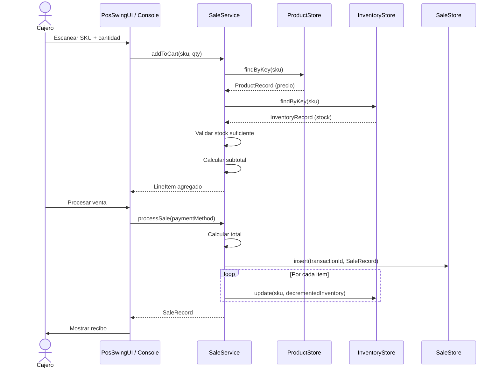

# Pukio POS Client

Terminal de punto de venta para procesamiento de transacciones locales.

## Tareas Completadas

✅ **TASK-E1-24** — Crear la clase principal `PosClientApplication.java` con menú de consola para operaciones de venta.

✅ **TASK-E1-25** — Implementar `SaleService.java`: método `processSale(sku, quantity, paymentMethod)`. *(REQ 1.6)*
  - Leer precio desde `IndexedFileStore<String, ProductRecord>` usando índice (SKU).
  - Verificar stock en `IndexedFileStore<String, InventoryRecord>`.
  - Calcular total de todos los ítems de la venta.
  - Registrar pago (método de pago).
  - Escribir `SaleRecord` en archivo indexado de ventas.
  - Decrementar inventario en archivo indexado.

✅ **TASK-E1-26** — Implementar generación de recibo de venta en consola con: ID transacción, timestamp, ítems, total, método de pago. *(REQ 1.6)*

✅ **TASK-E1-27** — Escribir tests unitarios para `SaleService` con mocks del `IndexedFileStore`. *(REQ 1.6)*

## Estructura del Módulo

```
pukio-pos-client/
├── pom.xml
├── src/
│   ├── main/
│   │   ├── java/com/pukio/pos/
│   │   │   ├── PosClientApplication.java       # Punto de entrada principal
│   │   │   ├── config/
│   │   │   │   └── PosStoreConfig.java         # Configuración de IndexedFileStore beans
│   │   │   ├── service/
│   │   │   │   ├── SaleService.java            # Lógica de procesamiento de ventas
│   │   │   │   └── ReceiptPrinter.java         # Generación de recibos
│   │   │   └── ui/
│   │   │       └── PosSwingUI.java             # Interfaz gráfica Swing
│   │   └── resources/
│   │       ├── application.properties          # Configuración con placeholders ${VAR}
│   │       └── application-secrets.properties.template  # Template para secretos locales
│   └── test/
│       └── java/com/pukio/pos/service/
│           └── SaleServiceTest.java            # Tests unitarios con Mockito
```

## Características Implementadas

### 1. SaleService (REQ 1.6)
- **Agregar productos al carrito**: Valida existencia de producto y stock disponible
- **Procesar venta**: Calcula total, registra transacción, decrementa inventario
- **Cancelar venta**: Limpia el carrito sin procesar
- **Ver carrito actual**: Consulta los ítems agregados

### 2. ReceiptPrinter (TASK-E1-26)
- Genera recibos formateados con:
  - ID de transacción
  - Fecha y hora
  - Método de pago
  - Detalle de productos (SKU, nombre, cantidad, precio unitario, subtotal)
  - Total de la venta
- Imprime en consola y retorna String para UI

### 3. PosSwingUI (TASK-E1-24)
Interfaz gráfica con:
- Panel de entrada: SKU, cantidad, método de pago
- Tabla de carrito: Muestra productos agregados
- Área de recibo: Visualiza el recibo generado
- Botones: Agregar al carrito, Procesar venta, Cancelar venta
- Label de total: Actualización en tiempo real

### 4. PosClientApplication (TASK-E1-24)
- Lanza UI Swing en Event Dispatch Thread
- Menú de consola paralelo para acceso por terminal
- Opciones:
  1. Agregar producto al carrito
  2. Ver carrito actual
  3. Procesar venta
  4. Cancelar venta
  0. Salir

### 5. PosStoreConfig (TASK-E1-22)
Configuración Spring que crea beans de `IndexedFileStore` para:
- Productos (lectura de precios)
- Inventario (verificación y decremento de stock)
- Ventas (registro de transacciones)

Todas las rutas de archivos se inyectan desde `application.properties` usando placeholders `${VAR}`.

## Tests Unitarios (TASK-E1-27)

`SaleServiceTest.java` incluye:
- ✅ `addToCart_validProduct_shouldAddLineItem`: Agregar producto válido
- ✅ `addToCart_productNotFound_shouldThrow`: Producto no encontrado
- ✅ `addToCart_outOfStock_shouldThrow`: Producto sin stock
- ✅ `addToCart_insufficientStock_shouldThrow`: Stock insuficiente
- ✅ `processSale_validCart_shouldRecordSaleAndDecrementInventory`: Venta exitosa
- ✅ `processSale_emptyCart_shouldThrow`: Carrito vacío
- ✅ `cancelSale_shouldClearCart`: Cancelación de venta

Todos los tests usan Mockito para simular `IndexedFileStore`.

## Configuración

### Archivo: application.properties (commiteado)
```properties
pukio.files.products=${PUKIO_FILES_PRODUCTS}
pukio.files.inventory=${PUKIO_FILES_INVENTORY}
pukio.files.sales=${PUKIO_FILES_SALES}
```

### Archivo: application-secrets.properties (NUNCA commiteado)
Copiar `application-secrets.properties.template` a `application-secrets.properties` y rellenar:
```properties
PUKIO_FILES_PRODUCTS=/ruta/absoluta/a/products
PUKIO_FILES_INVENTORY=/ruta/absoluta/a/inventory
PUKIO_FILES_SALES=/ruta/absoluta/a/sales
```

## Ejecución

```bash
# Compilar el módulo
mvn clean package

# Ejecutar la aplicación
mvn spring-boot:run

# O ejecutar el JAR generado
java -jar target/pukio-pos-client-1.0.0-SNAPSHOT.jar
```

## Dependencias

- **pukio-common**: Modelos y API de archivos indexados
- **spring-boot-starter**: Framework Spring Boot
- **lombok**: Reducción de boilerplate
- **slf4j-api**: Logging
- **spring-boot-starter-test**: Testing framework
- **mockito-core**: Mocking para tests
- **junit-jupiter**: Framework de tests

## Seguridad de Credenciales

⚠️ **IMPORTANTE**: El archivo `application-secrets.properties` está excluido del repositorio Git mediante `.gitignore`.

**NUNCA** commitear:
- `application-secrets.properties` (valores reales)
- Rutas absolutas del sistema de archivos
- Configuraciones específicas de máquina local

**SÍ** commitear:
- `application.properties` (solo placeholders `${VAR}`)
- `application-secrets.properties.template` (listado de variables sin valores)

## Cumplimiento de Requisitos

| Requisito | Descripción | Estado |
|-----------|-------------|--------|
| REQ 1.6 | Procesamiento de ventas local | ✅ Completo |
| TASK-E1-24 | Clase principal con menú de consola | ✅ Completo |
| TASK-E1-25 | SaleService con lógica completa | ✅ Completo |
| TASK-E1-26 | Generación de recibos | ✅ Completo |
| TASK-E1-27 | Tests unitarios con mocks | ✅ Completo |

## Flujo de Venta



---

**Módulo desarrollado para el proyecto Pukio — Sistema POS Minorista**  
**Stack**: Oracle JDK 21 · Spring Boot 3.3.5 · Maven 3.9.9
